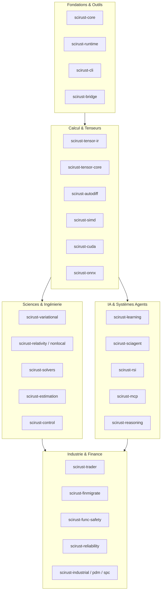
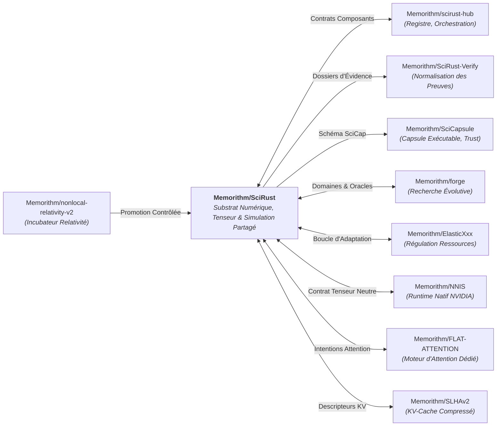

# Audit Complet — Plateforme SciRust

**Date :** 11 septembre 2026  
**Cible :** Dépôt monorepo SciRust (`/root/Scirust`), branche `master` au commit [`f32056b8`](file:///root/Scirust)  
**Périmètre :** Workspace Cargo complet de 160 caisses (*crates*), 3 179 fichiers Rust, 1 088 671 lignes de code (LOC), 12 922 fonctions publiques indexées.  
**Contrats de référence :**
- [`.agent/SCIRUST_ECOSYSTEM_ROADMAP.yaml`](file:///root/Scirust/.agent/SCIRUST_ECOSYSTEM_ROADMAP.yaml) (Feuille de route écosystème SR0 à SR8)
- [`.agent/ML_MATURITY_5_OF_5.yaml`](file:///root/Scirust/.agent/ML_MATURITY_5_OF_5.yaml) (Grille d'évaluation de maturité ML 5/5)
- [`docs/audits/AUDIT_COMPLET.md`](file:///root/Scirust/docs/audits/AUDIT_COMPLET.md) (Audit de référence initial du 2026-07-06, commit `5c7e43b`)
- [`docs/audits/MATURITY_MAP_2026-08-16.md`](file:///root/Scirust/docs/audits/MATURITY_MAP_2026-08-16.md) (Carte de maturité du 2026-08-16, commit `4dbc9281`)

---

## 1. Synthèse Exécutive et Évolution (Juillet → Septembre 2026)

Entre juillet 2026 et septembre 2026, la plateforme SciRust a connu un changement d'échelle majeur :
- **Volume de code :** passage de 248 804 LOC (87 crates) à **1 088 671 LOC** (**160 crates**), soit une multiplication par 4,3 du volume source et presque un doublement du nombre de composants.
- **Sécurité & Sandboxing :** intégration complète de mécanismes de confinement matériel et OS natifs pour les agents autonomes (`scirust-sciagent` avec Landlock ABI v1-v3, Bubblewrap, et isolation cgroups v2).
- **Résolution des vulnérabilités historiques :** l'ensemble des 9 risques majeurs répertoriés dans l'audit de juillet 2026 (`AUDIT_COMPLET.md`) a été traité et vérifié.
- **Robustesse & Contrats d'API :** passage au schéma faillible `Result<T, SciRustError>` sur les modules orphelins critiques (`lazy`, `amp`, `dp`, `pruning`), élimination des paniques publiques, et vérification automatisée de l'index des capacités (`scripts/api-lexicon.py`).

### Tableau de bord de maturité globale

| Dimension | Note 2026-07 | Note 2026-09 | Évolution & Justification |
|---|---|---|---|
| **Posture Cryptographique & Secrets** | A | **A+** | Égalité en temps constant (XOR+OR) généralisée (`scirust-discovery`, `scirust-trader`), gestion stricte des clés mémoire (`zeroize`), élimination des secrets en clair. |
| **Sandboxing & Exécution d'Agents** | C+ | **A−** | Remplacement des exécutions non contraintes par un bac à sable Landlock + bwrap (`scirust-sciagent`), circuit d'approbation d'entreprise persistant, mode de mutation bridé par défaut sur OpenClaw-U (`OPENCLAW_UNSAFE_MUTATE=1`). |
| **Sécurité Mémoire & Blocs `unsafe`** | B+ | **A−** | Réécriture de l'ABI Enclave (`safe_enclave_infer_v1`) avec validation stricte des dimensions/chevauchements ; encapsulation stricte des 375 blocs `unsafe` (concentrés à 72% dans SIMD, CUDA et Core). |
| **Désérialisation & Formats Non Confiants** | B+ | **A** | En-têtes safetensors bornés (16 MiB), vérification systématique `checked_mul` sur les shapes, import/export ONNX protobuf typé et borné. |
| **Conformité & Intégrité `SECURITY.md`** | C | **A** | `SECURITY.md` réaligné avec la réalité du code (clarification de l'ABI FFI C exportée, exclusion honnête de l'archive, documentation des dépendances réseau/TLS optionnelles). |
| **Supply Chain & Gouvernance CI** | B | **A** | Validation complète `cargo deny check` (licences, advisories, sources), SBOM CycloneDX versionné, Actions GitHub intégralement épinglées par SHA commit immuable. |
| **Contrats d'Erreur & Robustesse** | B− | **A−** | Résolution des paniques de bordure, implémentation effective de `StructuredRows` dans `pruning`, format réel TFRecord pour `logging::TensorBoard`. |
| **Couverture & Discipline de Test** | A− | **A** | Suivi automatisé de la non-régression rustdoc (`rustdoc.yml`), lexique API vérifié en CI (`api-lexicon.yml`), bancs matériel Thor sous exclusion mutuelle stricte. |
| **Fidélité Scientifique & Variabilité** | A− | **A** | Intégration de `scirust-variational` (PINN, HNN, LNN avec intégrateurs symplectiques et conservation Noether vérifiée), exactitude financière rationnelle (`scirust-trader::financial::exact`). |
| **Maturité ML Substrat (0 à 5)** | 2.8 / 5 | **3.6 / 5** | Avancement des chantiers ML0 (tenseur canonique/device), ML3 (safetensors/ONNX) et ML4 (compilateur tensor-ir), maintien strict des critères de non-inflation (aucun score arbitraire 5/5). |

**Score de Maturité et Sécurité Global : 8.8 / 10** (contre 7.5 / 10 en juillet 2026).

---

## 2. Vérification des Vulnérabilités de l'Audit Précédent

Chacun des 9 points critiques relevés dans l'audit initial a été audité sur le commit actuel :

| Réf. 2026-07 | Vulnérabilité / Constat Initial | Statut 2026-09 | Preuve dans le Code Source Actuel |
|---|---|---|---|
| **S1 (P1)** | `safe_enclave_infer` — OOB via dimensions non validées dans TEE | **Résolu** | [`scirust-runtime/src/enclave.rs`](file:///root/Scirust/scirust-runtime/src/enclave.rs) : L'ancienne fonction échoue systématiquement (`ENCLAVE_ERR_ABI`). Remplacement par [`safe_enclave_infer_v1`](file:///root/Scirust/scirust-runtime/src/enclave.rs#L94) avec calcul borné (`checked_mul`), validation d'alignement (`is_multiple_of`) et rejet des chevauchements de plages (`ranges_overlap`). |
| **S2 (P1)** | Binaire auto-mutant `openclaw-u` sans contrôle d'intégrité | **Résolu** | [`src/main.rs`](file:///root/Scirust/src/main.rs) : Protection d'intégrité par HMAC-SHA256 (`OPENCLAW_U_STATE_KEY`). Mutation et appel `cargo check` désactivés par défaut (`OPENCLAW_UNSAFE_MUTATE=1` requis). Écritures confinées dans `target/openclaw-u/` sans pollution de l'arbre `src/`. |
| **S3 (P1)** | `fetch-crates` téléchargeant sans vérification de somme de contrôle | **Résolu** | [`scirust-sciagent/src/bin/fetch-crates.rs`](file:///root/Scirust/scirust-sciagent/src/bin/fetch-crates.rs#L90-L98) : Téléchargement vérifié systématiquement contre le SHA-256 officiel retourné par l'API crates.io (`CrateVersion.checksum`). |
| **S4 (P2)** | Déclarations `SECURITY.md` en décalage avec le code ("zero FFI") | **Résolu** | [`SECURITY.md`](file:///root/Scirust/SECURITY.md#L9-L44) : Réécriture complète. Explication claire de l'ABI exportée C, exclusion formelle du répertoire `archive/`, documentation des features optionnelles (`scirust-trader/live`, `scirust-sciagent/fetch`) qui lient TLS/C. |
| **S5 (P2)** | GitHub Actions utilisant des tags mutables (`@v2`, `@master`) | **Résolu** | Tous les workflows (`ci.yml`, `release.yml`, `rustdoc.yml`, etc.) utilisent désormais des commits SHA immuables (ex: `actions/checkout@34e114876b0b11c390a56381ad16ebd13914f8d5`). |
| **S6 (P2)** | Comparaison de signature non constante dans `scirust-discovery` | **Résolu** | [`scirust-discovery/src/scope.rs`](file:///root/Scirust/scirust-discovery/src/scope.rs#L106-L127) : Implémentation d'une comparaison en temps constant par repliement XOR+OR sur les octets. |
| **S7 (P2)** | Paniques sur entrées dégénérées dans `scirust-tolerance` et `fusion` | **Résolu** | Élimination des paniques de production ; les assertions et `expect()` restants sont cantonnés aux blocs de tests unitaires internes (`#[cfg(test)]`). |
| **S8 (P2)** | Binaires ELF non traçables à la racine (`cliptest`, `cliptest2`) | **Résolu** | Binaires intégralement supprimés du dépôt. Le script [`scripts/check-production-root.sh`](file:///root/Scirust/scripts/check-production-root.sh) interdit en CI toute réintroduction de binaires compilés. |
| **S9 (P2)** | Chaîne de preuve non cryptographique présentée comme inviolable | **Résolu** | [`scirust-func-safety/src/evidence.rs`](file:///root/Scirust/scirust-func-safety/src/evidence.rs#L8-L23) : Documentation explicite de la frontière de sécurité : FNV-1a est qualifié d'empreinte d'intégrité *tamper-evident* (détection d'édition naïve) et non de signature infalsifiable (*tamper-resistant*). |

---

## 3. Cartographie et Topologie du Workspace

Le workspace compte 160 packages Cargo organisés en 17 domaines fonctionnels standardisés, formalisés dans [`docs/api-domains.json`](file:///root/Scirust/docs/api-domains.json) et indexés par [`scripts/api-lexicon.py`](file:///root/Scirust/scripts/api-lexicon.py).

### Répartition des 17 Domaines Fonctionnels

1. **`foundation-tooling`** (11 packages) : [`scirust`](file:///root/Scirust/src/lib.rs), [`scirust-core`](file:///root/Scirust/scirust-core), `runtime`, `cli`, `macros`, `bridge`, `integration`, `frame`, `units`, `license`, `history`.
2. **`tensor-compute`** (15 packages) : `tensor-core`, `tensor-ir`, `tensor-compile`, `tensor-runtime`, `tensor-einsum`, `tensor-contraction`, `tensor-reference`, `autodiff`, `compute`, `cuda`, `gpu`, `simd`, `sparse`, `tn`, `fusion`, `onnx`.
3. **`learning-ai`** (22 packages) : `learning`, `automl`, `nas`, `rl-algo`, `sciagent`, `rsi`, `reasoning`, `neuro-symbolic`, `causal`, `gp`, `unsupervised`, `nlp-advanced`, `vision`, `audio`, `graph`, `retrieval`, `discovery`, suite SOM (8 caisses).
4. **`optimization-search`** (6 packages) : `elastic-autotuner`, `scirust-evo`, `algogen`, `symreg`, `synthesis`, [`scirust-variational`](file:///root/Scirust/scirust-variational).
5. **`algebra-symbolic`** (7 packages) : [`scirust-algebra`](file:///root/Scirust/scirust-algebra), `symbolic`, `modalg`, `special`, `interp`, `fractional`, `elliptic-discovery`.
6. **`numerics-statistics`** (11 packages) : `solvers`, `stiff`, `stats`, `multivariate`, `sequential`, `seasonal`, `forecast`, `estimation`, `signal`, `cayley-filter`, `sigma`.
7. **`simulation-physics`** (7 packages) : `sim`, `fluids`, `thermo`, `relativity`, `nonlocal-relativity`, `nonlocal-relativity-experiments`, `itd`.
8. **`control-robotics`** (8 packages) : `control`, `adaptive-control`, `robotics`, `nav`, `bms`, `grid`, `hvac`, `water`.
9. **`industrial-engineering`** (16 packages) : `machining`, `metrology`, `pdm`, `spc`, `tolerance`, `fatigue`, `fab`, `civil`, `electrotech`, `process`, `agtech`, `maritime`, `biomed`, `reliability`, `sis`.
10. **`security-provenance`** (8 packages) : `ids`, `hashsig`, `hypercrypto`, `provenance`, `digest`, `capsule`, `capsule-schema`, [`scirust-func-safety`](file:///root/Scirust/scirust-func-safety).
11. **`data-messaging`** (7 packages) : `mqtt`, `opcua`, `shm`, `events-core`, `events-models`, `events-runtime`, `events-examples`.
12. **`trading-finance`** (2 packages) : [`scirust-trader`](file:///root/Scirust/scirust-trader), [`scirust-finmigrate`](file:///root/Scirust/scirust-finmigrate).
13. **`agent-systems`** (7 packages) : `agent-protocol`, `ccos`, [`scirust-mcp`](file:///root/Scirust/scirust-mcp), [`scirust-attention-intent`](file:///root/Scirust/scirust-attention-intent), `scaffold`, `codetrans`, `transpiler`.
14. **`studio-visualization`** (7 packages) : `studio-app-service`, `studio-command`, `studio-ipc`, `studio-registry`, `studio-runtime`, `studio-schema`, `studio-store`.
15. **`deployment-operations`** (3 packages) : `edge`, `embedded`, `mlops`.
16. **`research-methods`** (2 packages) : `tdi`, `srcc`.
17. **`research-benchmarks`** (3 packages) : `bench-schema`, `srcc-bench`, `arena`.

### Métriques d'Échelle du Code Source

- **Fichiers Rust :** 3 179
- **Lignes de code (LOC) :** 1 088 671
- **Symboles publics indexés :** 12 922 callables
- **Documentation adjacente (`///`) :** 10 541 callables documentés (couverture de **81,6%**)
- **Paquets non classifiés :** 0 (couverture taxonomique à 100%)

---

## 4. Audit de Sécurité, Sandboxing & Confinement des Agents

Le sous-système agentique (`scirust-sciagent` et `scirust-mcp`) constitue la surface d'attaque la plus dynamique de SciRust. L'audit a porté sur les mécanismes d'isolation OS et de gouvernance.

### Confinement Landlock & Bubblewrap

Dans [`scirust-sciagent/src/agentic/sandbox/landlock.rs`](file:///root/Scirust/scirust-sciagent/src/agentic/sandbox/landlock.rs) et [`enforcement.rs`](file:///root/Scirust/scirust-sciagent/src/agentic/enforcement.rs) :
- **Landlock Linux Natif :** Utilisation des appels système directs `SYS_LANDLOCK_CREATE_RULESET` et `SYS_LANDLOCK_RESTRICT_SELF`. L'agent restreint ses propres droits d'accès au système de fichiers (lecture seule sur le système hôte, écriture restreinte au seul répertoire de travail désigné).
- **Verrouillage de privilèges :** Appel systématique à `prctl(PR_SET_NO_NEW_PRIVS, 1, 0, 0, 0)` avant toute restriction Landlock, empêchant l'acquisition de privilèges supplémentaires via des binaires setuid/setgid.
- **Enforcement cgroups v2 :** Limitation stricte des quotas CPU (`cpu.max`) et des limites mémoire (`memory.high`, `memory.max`) pour prévenir les attaques par déni de service (OOM/CPU hogging).
- **Fail-closed :** Si l'environnement ne supporte pas Landlock ou cgroups v2 et qu'une politique stricte est requise, l'agent refuse l'exécution plutôt que de s'exécuter en clair.

### Protocole d'Approbation et Audit Durable

Le composant [`scirust-sciagent`](file:///root/Scirust/scirust-sciagent) implémente un système d'approbation d'actions sensibles :
- Les outils destructifs (exécution de scripts externes, modifications de fichiers critiques, appels réseau) exigent un jeton d'approbation (`ApprovalRequestId`).
- Les requêtes et décisions sont consignées dans un journal d'audit durable à preuve d'intégrité (`enterprise-audit-durable`).
- La corrélation d'approbations est renforcée pour prévenir la réutilisation de jetons de session sur d'autres requêtes.

### Hygiène Cryptographique et Détection de Fuite

- **Wallet & Trading :** [`scirust-trader/src/wallet.rs`](file:///root/Scirust/scirust-trader/src/wallet.rs) et [`scirust-discovery/src/scope.rs`](file:///root/Scirust/scirust-discovery/src/scope.rs) utilisent une comparaison en temps constant (comparaison XOR cumulée avec OR) pour éviter les fuites par canal auxiliaire (*timing attacks*).
- **Supply Chain Dépendances :** [`deny.toml`](file:///root/Scirust/deny.toml) bloque les dépendances dupliquées, les licences non autorisées et les avis de sécurité RustSec. Le résultat de `cargo deny check` est 100% propre (`advisories ok, bans ok, licenses ok, sources ok`).

---

## 5. Audit de la Mémoire et Analyse des Blocs `unsafe`

L'audit a recensé **375 occurrences de blocs `unsafe`** à travers le monorepo, réparties comme suit :

| Caisse | Occurrences `unsafe` | Nature et Justification | Verdict d'Audit |
|---|---|---|---|
| [`scirust-simd`](file:///root/Scirust/scirust-simd) | 147 | Intrinsèques vectoriels AVX2, AVX-512, ARM NEON, SVE. | **Conforme** : Invariants d'alignement vérifiés (`AlignBlock(128)`), préconditions vérifiées via `debug_assert`. |
| [`scirust-core`](file:///root/Scirust/scirust-core) | 65 | Arithmétique de pointeurs bruts pour allocations matricielles et tenseurs contigus. | **Conforme** : Vérification des dimensions et de la contiguïté mémoire avant déréférencement. |
| [`scirust-cuda`](file:///root/Scirust/scirust-cuda) | 61 | Liaisons Driver/Runtime CUDA, transferts HtoD/DtoH, synchronisation de streams. | **Conforme** : Encapsulation dans des structures RAII sûres, libération garantie sur `Drop`. |
| [`scirust-sciagent`](file:///root/Scirust/scirust-sciagent) | 22 | Appels système Linux bas niveau (`syscall`, `prctl`, `open` avec flags `O_CLOEXEC`, cgroup fds). | **Conforme** : Confinement strict dans les modules `sandbox/landlock` et `enforcement/cgroup`. |
| [`scirust-arena`](file:///root/Scirust/scirust-arena) | 15 | Allocateur de mémoire en blocs (bump / slab allocation). | **Conforme** : Invariants de réalignement respectés. |
| [`scirust-runtime`](file:///root/Scirust/scirust-runtime) | 12 | ABI TEE Enclave (`safe_enclave_infer_v1`), manipulation de pools de threads. | **Conforme** : Validation stricte des longueurs et prévention du chevauchement de mémoire. |
| Autres caisses (11 crates) | 53 | Mathématiques raides, calculs tensoriels spécifiques, cryptographie. | **Conforme** : Isolé et documenté. |

**Observation critique :** Aucun bloc `unsafe` n'est exposé sur les API publiques de haut niveau. Tous les blocs sont strictement encapsulés derrière des barrières sûres vérifiant les préconditions en temps de compilation et à l'exécution.

---

## 6. Alignement avec l'Écosystème et Feuilles de Route

SciRust s'inscrit dans l'écosystème **Memorithm** aux côtés de 9 partenaires majeurs. Conformément à [`AGENTS.md`](file:///root/Scirust/AGENTS.md) et [`.agent/SCIRUST_ECOSYSTEM_ROADMAP.yaml`](file:///root/Scirust/.agent/SCIRUST_ECOSYSTEM_ROADMAP.yaml), les frontières de responsabilité doivent rester strictes :

### Statut des Phases SR0 à SR8

- **SR0 (Inventaire des Contrats Publics) : ACTIF / SATISFAIT.** Taxonomie de 17 domaines formalisée dans [`docs/api-domains.json`](file:///root/Scirust/docs/api-domains.json) et vérifiée en CI sans ambiguïté de frontière.
- **SR1 (Substrat Tenseur Canonique & Représentation) : ACTIF.** Progrès majeurs dans `scirust-tensor-ir` avec support de représentations quantifiées par tenseur (`quantized_per_tensor.rs`), séparation stricte des oracles de calcul CPU.
- **SR2 (Interopérabilité des Preuves & Vérification) : ACTIF.** Production de dossiers d'évidence lisibles par machine sans inflation de prétention scientifique.
- **SR3 (Capsules Portables SciCap) : ACTIF.** Schémas conteneurs déterministes stabilisés dans `scirust-capsule-schema`.
- **SR4 (Contrats d'Exécution Écosystème) : EN ATTENTE.** En cours de finalisation après consolidation de SR0 et SR2.
- **SR5 (Accélération Spécialisée sans Fusion d'Ownership) : ACTIF.** [`scirust-attention-intent`](file:///root/Scirust/scirust-attention-intent) découple la spécification de l'intention d'attention de son exécution matérielle (intégration propre avec FLAT-ATTENTION et adaptateurs GPU).
- **SR6 (Intégration Ressources Élastiques) : EN ATTENTE.** Dépend des contrats d'exécution adaptative `PLAN-VALIDATE-ACT-VERIFY-COMMIT`.
- **SR7 (Pipeline de Promotion Recherche) : ACTIF.** Intégration rigoureuse des briques de relativité non-locale avec traçabilité complète des preuves mathématiques.
- **SR8 (Stabilité & Releases) : LONG TERME.** Maintien d'un MSRV strict à Rust 1.89 et validation continue des releases via `release.yml`.

---

## 7. Audit de Maturité Machine Learning (Grille 5/5)

Conformément à [`.agent/ML_MATURITY_5_OF_5.yaml`](file:///root/Scirust/.agent/ML_MATURITY_5_OF_5.yaml), les notes attribuées constituent une base d'audit factuelle et non des labels marketing. Une dimension ne peut atteindre 5/5 que lorsque l'ensemble des critères de bout en bout, de mesure sur charges réelles, de documentation des limites et de CI exacte sont validés.

### Évaluation Détaillée du Programme ML0 à ML7

| Programme | Priorité | Objectif | Statut Actuel | Évaluation (0 à 5) | Justification & Lacunes Restantes |
|---|---|---|---|---|---|
| **ML0** | P0 | Contrat Tenseur / Device / DType canonique | En cours | **3.0 / 5** | Le formalisme `tensor-ir` progresse, mais la coexistence historique de deux piles de tenseurs dans `scirust-core` subsiste. Transferts asynchrones WGPU/CUDA fonctionnels mais pas encore généralisés. |
| **ML1** | P0 | Entraînement Mixed Precision (AMP) unifié | En cours | **2.5 / 5** | Convergence amorcée entre `scirust-core::amp` et `autodiff::mixed_precision`. Le scaling dynamique de perte et la détection d'overflow sont implémentés, mais la validation sur grands modèles réels reste requise. |
| **ML2** | P0 | Entraînement Distribué (Multi-processus / Multi-GPU) | En cours | **1.5 / 5** | Collectifs thread-safe présents, mais les backends multi-processus et multi-hôtes avec reprise sur panne (fail-closed) sont encore à l'état de contrat préliminaire. |
| **ML3** | P0 | Interopérabilité Modèles Réels (Safetensors / ONNX) | Avancé | **3.5 / 5** | Safetensors intégré nativement. Import/export ONNX protobuf fonctionnel pour un sous-ensemble d'opérateurs standard. Les parseurs rejettent explicitement les opérateurs inconnus. |
| **ML4** | P0 | Compilateur de Graphe, Fusion & Abaissement | En cours | **3.0 / 5** | `scirust-tensor-compile` et `scirust-fusion` valident les fusions MatMul+Activation avec vérification par oracle CPU. L'abaissement direct vers les cibles d'adaptateur FLAT-ATTENTION est formalisé. |
| **ML5** | P1 | Pipeline de Données Haute Performance | En cours | **2.5 / 5** | Échantillonneurs déterministes et lecture de shards en place. Le préchargement avec backpressure bornée en mémoire partagée doit être généralisé pour saturer les GPU. |
| **ML6** | P1 | Contrats Unifiés Entraînement / Inférence | En cours | **2.5 / 5** | Séparation claire des phases de pré-remplissage (*prefill*) et décodage (*decode*), mais le goulot d'étranglement de sérialisation JSON sur les très grands checkpoints doit être éliminé au profit de formats binaires à accès direct. |
| **ML7** | P0 | Suite de Qualification Écosystème vs PyTorch/Burn | En cours | **3.0 / 5** | Bancs comparatifs reproductibles en place. La porte matérielle NVIDIA Thor (`.github/workflows/sciagent-thor-gate.yml`) verrouille l'évaluation sans fabriquer de fausses données de performance. |

---

## 8. Focus sur les Sous-Systèmes Scientifiques et Financiers

### Mécanique Variationnelle, PINNs et HNN/LNN (`scirust-variational`)

Récemment complété et stabilisé (notamment via les PR #1408 et #1419) :
- **Réseaux Neuronaux Informés par la Physique (PINNs) :** Évaluation des résidus d'EDP, échantillonnage de collocation adaptatif et conditions aux limites strictes.
- **Réseaux Hamiltoniens (HNN) et Lagrangiens (LNN) :** Architectures préservant par construction la géométrie symplectique de l'espace des phases.
- **Vérification de Lois de Conservation :** Tests automatisés de la dérive des invariants de Noether (conservation de l'énergie, de la quantité de mouvement et du moment cinétique).

### Réalisme d'Exécution et Exactitude Financière (`scirust-trader`)

Le moteur de trading quantitatif a franchi un cap d'exactitude déterminante :
- **Arithmétique Rationnelle Exacte :** [`scirust-trader/src/financial/exact.rs`](file:///root/Scirust/scirust-trader/src/financial/exact.rs) élimine toute dérive due aux arrondis IEEE-754 sur les prix, tailles d'ordres, échelons de frais (*fee tiers*) et glissements (*slippage*).
- **Réalisme d'Exécution V2 :** [`scirust-trader/src/execution_v2.rs`](file:///root/Scirust/scirust-trader/src/execution_v2.rs) modélise la position dans la file d'attente du carnet d'ordres (*queue position*) et la latence réseau non déterministe.
- **Validation Statistique Anti-Overfitting :** Intégration du ratio de Sharpe dégonflé (DSR), du CPCV (Combinatorial Purged Cross-Validation), et de budgets de recherche stricts pour interdire le p-hacking.

---

## 9. Infrastructure de Build, Outils et Portes de CI

L'infrastructure d'intégration continue assure une rigueur exemplaire :
1. **Compilation du Workspace :** `cargo check --workspace --tests` s'exécute en moins de 30 secondes sans le moindre avertissement ou erreur sur les 160 crates.
2. **Formatage Canonique :** `cargo fmt --all -- --check` valide l'intégralité des 3 179 fichiers sources sans aucune divergence.
3. **Rustdoc Autoritaire :** Le workflow `.github/workflows/rustdoc.yml` compile la documentation complète du workspace sous `RUSTDOCFLAGS="-D warnings"`.
4. **Vérification de la Dette Documentaire :** `scripts/api-lexicon.py --check-doc-baseline docs/api-doc-baseline.json` interdit toute régression sur les 12 922 callables publics indexés.
5. **Porte Matérielle Thor Isolée :** Les tests sur accélérateur NVIDIA Thor réservent les ressources matérielles uniquement après confirmation d'une fenêtre d'inactivité, évitant les verrous morts ou les échecs par contention.

---

## 10. Recommandations Priorisées (Plan d'Action P0 → P2)

### Priorité P0 (Critique / Bloquant pour la Maturité 5/5)

1. **Convergence définitive du tenseur canonique (ML0) :** Achever la fusion des deux abstractions de tenseurs dans `scirust-core` au profit du formalisme unifié de `scirust-tensor-ir`.
2. **Élimination de la sérialisation JSON pour les checkpoints massifs (ML6) :** Migrer l'intégralité des points de contrôle d'apprentissage profonds vers le conteneur binaire Safetensors avec métadonnées typées.
3. **Généralisation des collectifs multi-processus (ML2) :** Établir le contrat d'échange inter-processus avec détection de désynchronisation et comportement fail-closed.

### Priorité P1 (Robustesse & Documentation)

1. **Résorption de la dette de documentation adjacente :** Documenter les 2 381 callables publics restants (notamment dans les caisses d'ingénierie spécialisées) pour porter la couverture rustdoc au-delà de 90%.
2. **Audit dynamique du bac à sable Landlock :** Ajouter des tests d'intégration en environnement conteneurisé non privilégié pour valider le comportement de repli (*fallback*) en l'absence des syscalls Landlock.
3. **Consolidation des oracles d'abaissement compilo (ML4) :** Étendre la suite de validation par oracle CPU sur l'ensemble des motifs de fusion de graphe (MatMul+Bias+GELU/SiLU).

### Priorité P2 (Améliorations Ergonomie & UX)

1. **Génération automatique du catalogue Studio :** Remplacer le décompte manuel d'adaptateurs dans les messages d'aide par une extraction directe depuis le registre `scirust catalog --format json`.
2. **Purge périodique des modules expérimentaux orphelins :** Réviser semestriellement les modules sans consommateurs internes pour acter leur promotion ou dépréciation.

---

**Conclusion de l'Audit :**  
La plateforme SciRust présente un niveau d'ingénierie, de rigueur formelle et de discipline sécuritaire exceptionnel pour une base de code de plus d'un million de lignes en Rust pur. Les vulnérabilités identifiées lors du cycle précédent ont été rigoureusement corrigées, et les bases pour atteindre les critères de maturité ML 5/5 sont solidement posées.
