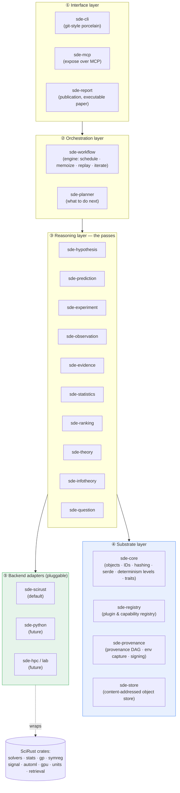
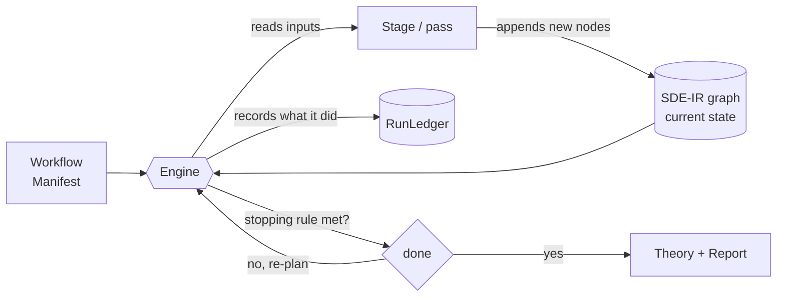
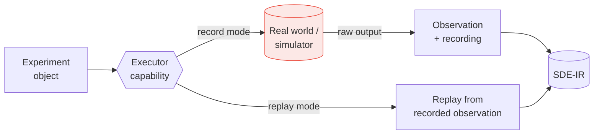
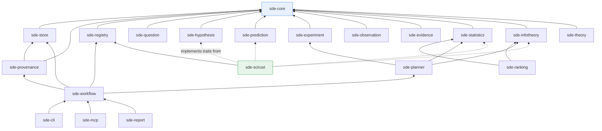

# 02 · Architecture Overview

> [← Vision & Philosophy](./01-vision-and-philosophy.md) · [Object Model →](./03-object-model.md)

---

## 1. The one idea: the discovery graph is an IR

The load-bearing insight of SDE is that **the entire scientific process can be
represented as a single intermediate representation** — a directed acyclic graph
of immutable, content-addressed scientific objects, which we call **SDE-IR**.
Every pipeline stage is a *pass* that reads some nodes and appends new ones.
Nothing is ever mutated; the graph only grows.

This mirrors LLVM exactly:

| LLVM | SDE |
|---|---|
| LLVM-IR (SSA value graph) | SDE-IR (scientific object DAG) |
| Frontend (Clang, rustc) | **Domain** (physics, finance, biology…) — lowers a real problem into SDE-IR |
| Pass (`-mem2reg`, `-inline`) | **Stage** (hypothesis-gen, ranking, planning…) — transforms SDE-IR |
| Pass manager | **Workflow engine** — schedules stages over the graph |
| Backend (x86, ARM, GPU) | **Compute backend** (`sde-scirust`, Python, HPC, lab) — executes the effectful stages |
| Pass registry | **Plugin registry** — stages/domains/backends by name + version |

Because the middle is a stable IR, a new domain is a frontend, a new compute
substrate is a backend, and a new reasoning technique is a pass — none of them
requires touching the others. That is what "backend-agnostic" *means*
structurally, not just aspirationally.

---

## 2. The layered architecture

**Reading the layers top-down:**

1. **Interface** — how humans and other agents drive SDE: a `git`-style CLI, an
   MCP server (so `scirust-sciagent` or any external agent can call SDE as
   tools), and the report/publication generator.
2. **Orchestration** — the engine that runs workflows over the graph and the
   planner that decides the next experiment.
3. **Reasoning** — the stages themselves, one crate per pipeline concern. These
   are thin: they define the *contract* and the *default logic*, and delegate
   heavy computation to backend plugins.
4. **Substrate** — the object model, the registry, the provenance/store
   machinery. This is the stability surface; everything above depends on it.
5. **Backend adapters** — where real computation happens. `sde-scirust` is the
   default and wraps the SciRust crates; others plug in identically.

**Dependency direction is strictly downward.** No reasoning crate depends on
another reasoning crate at the type level; they compose only through `sde-core`
traits and by reading/writing SDE-IR. This keeps every stage independently
replaceable (Invariant: "every stage must be independently replaceable").

---

## 3. Control flow vs. data flow

Two flows run through SDE and must not be conflated.

- **Data flow** is the SDE-IR graph: append-only, content-addressed,
  monotonic. Objects only ever get *added*. This is the reproducible substrate.
- **Control flow** is the workflow engine's schedule: which stage runs when,
  what it reads, whether a cached result is reused, when the loop stops. Control
  flow is *derived from* the manifest and the current graph and is itself
  recorded (as a `RunLedger` object), so "what the engine did" is as
  reproducible as "what the objects are."

The engine is an **interpreter over an immutable graph**, closer to a build
system (Bazel/Nix) than to a script runner: it computes what *needs* to run by
diffing the manifest's requested outputs against what the graph already
content-addresses, runs only that, and memoizes the rest.

---

## 4. The effect boundary

Almost everything is pure. The exception is the `Execution` → `Observation`
transition, where the engine leaves the deterministic world and touches a
simulator, an instrument, a market, or a human. SDE handles this with a
**capability + record/replay** design (detailed in
[04](./04-workflow-engine.md#5-the-effect-boundary-executors)):

- In **record mode**, the executor performs the effect and stores the raw
  observation as an immutable object (an L0 leaf — see the determinism
  taxonomy). Authorization to perform the effect is a signed, time-boxed
  capability, patterned on `scirust-discovery::ScopeAuthorization`.
- In **replay mode**, the executor returns the recorded observation instead of
  touching the world. A replay of a workflow is therefore **fully deterministic
  from the observations down**, even when the original experiment was
  physical and irreproducible.

This is the mechanism that lets an inherently stochastic or one-shot experiment
sit inside a reproducible pipeline: SDE reproduces the *reasoning*, and replays
the *observations*.

---

## 5. Inter-crate dependency graph (substrate & reasoning)

A condensed view; the full crate table is in
[09](./09-workspace-and-crates.md).

Note the shape: `sde-core` is the universal sink (everything depends on it,
it depends on nothing in SDE). Backend adapters like `sde-scirust` depend only
on the *registry* and *implement* the reasoning-crate traits — they are never
depended-upon by name, which is exactly what makes them swappable.

---

## 6. A worked trace (one loop iteration)

To make the abstraction concrete, here is a single turn of the loop for a
toy question, "*what law relates these two measured quantities?*":

1. **Question** `Q` is created (`sde-question`) with a description, a domain
   tag, and a success criterion. → node `Q#a1b2…`
2. **Hypothesis generation** (`sde-hypothesis`, backed by `sde-scirust`'s
   `symreg` adapter) proposes three candidate laws as symbolic `Expr` trees,
   each a node citing `Q`. → `H1, H2, H3`
3. **Prediction** (`sde-prediction`, backed by `symbolic`/`solvers`) evaluates
   each hypothesis on a proposed input grid, producing predicted observables
   with uncertainty. → `P1, P2, P3`
4. **Experiment design** (`sde-experiment`) turns "measure on this grid" into a
   concrete, costed `Experiment` object, and — crucially — **hashes it before
   execution** (pre-registration). → `E`
5. **Execution + Observation** (the effect boundary) runs `E` on the simulator
   or instrument via an authorized `Executor`, recording raw output. → `O`
6. **Evidence extraction** (`sde-evidence`, backed by `signal`) reduces `O` to
   features/residuals per hypothesis. → `Ev`
7. **Statistical evaluation** (`sde-statistics`, backed by `stats`) computes a
   likelihood/goodness-of-fit for each hypothesis given `Ev`. → `S`
8. **Ranking** (`sde-ranking` + `sde-infotheory`) updates the posterior over
   `{H1,H2,H3}` and ranks them; detects any contradiction (e.g. a hypothesis
   now excluded). → `R`
9. **Theory revision** (`sde-theory`) records the new belief state as a
   `Theory` revision citing `R`. → `T(rev n+1)`
10. **Planning** (`sde-planner`) computes expected information gain for each
    candidate *next* experiment and recommends the most informative one — or
    declares the stopping rule met. → `Plan` (loops to step 4, or stops).

Every arrow above is a provenance edge; the entire trace is one connected
sub-DAG that `sde clone` reproduces and `sde-report` can render as a paper.

---

## 7. Why this shape scales to "infrastructure"

- **Additive, not invasive.** New capability = new node type or new plugin, never
  a schema migration of existing objects. The graph from 2027 still replays in
  2032.
- **Federated by construction.** Content-addressing means two organizations
  independently produce the *same ID* for the same object. Merging two labs'
  graphs is a set union plus conflict objects — the "pull request for science"
  model.
- **Backend competition is healthy.** Because backends are swappable and the
  `CpuBackend` in `scirust-gpu` is a permanent bit-exact oracle, a new GPU or a
  new solver can be *validated against the reference* inside SDE before anyone
  trusts it — the engine turns backend choice into an empirical, recorded
  decision.

---

> [← Vision & Philosophy](./01-vision-and-philosophy.md) · [Object Model →](./03-object-model.md)
