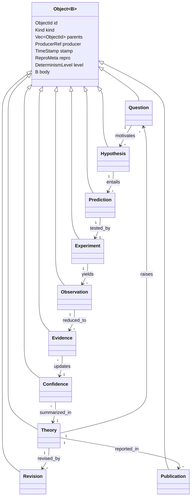

# 03 · Object Model

> [← Architecture Overview](./02-architecture.md) · [Workflow Engine →](./04-workflow-engine.md)

All Rust in this document is **illustrative, non-normative sketch** — type and
trait *signatures* that fix the design's shape, not an implementation. SDE is a
design at this stage (see [scope](./README.md#non-goals-for-v1)).

---

## 1. Everything is a scientific object

Every artifact in SDE-IR — a question, a hypothesis, a fitted parameter, a
belief state — shares one envelope. This is the single most important type in
the system, and it is the direct generalization of
`scirust-bench-schema::BenchRecord` (one record shape, seed mandatory, stable
field order) from benchmarks to the whole pipeline.

```rust
/// The universal envelope. Immutable. Its `id` is the hash of everything else.
pub struct Object<B> {
    /// Content address: BLAKE3 of the canonical serialization of all fields
    /// below (including `parents` and `body`). Deterministic across machines.
    pub id: ObjectId,
    /// The object's kind + schema version, e.g. ("Hypothesis", 1).
    pub kind: Kind,
    /// Direct provenance: the objects this one was derived from.
    pub parents: Vec<ObjectId>,
    /// The plugin (name + semver + its own content hash) that produced this.
    pub producer: ProducerRef,
    /// Logical + wall-clock time (see §5 on why both, and why logical wins).
    pub stamp: TimeStamp,
    /// Everything needed to reproduce this object (seed, env digest, level).
    pub repro: ReproMeta,
    /// Declared determinism level realized for THIS object (L0..L3).
    pub level: DeterminismLevel,
    /// The kind-specific payload (Question, Hypothesis, …).
    pub body: B,
}
```

### The six mandatory guarantees (from the brief)

The brief requires every object to carry UUID, provenance, timestamps,
reproducibility metadata, serialization, and deterministic hashing. Here is
where each lives — and note that SDE upgrades "UUID" to a **content hash**,
which is strictly stronger:

| Requirement | Field / mechanism | Notes |
|---|---|---|
| **UUID** | `id: ObjectId` | *Content-addressed*, not random. Same content ⇒ same ID on any machine. A random UUID would break dedup and cross-lab agreement; a content hash gives identity **and** integrity for free. A human-facing random `Urn` alias is available for objects that must be named before their content exists (see §4). |
| **Provenance** | `parents` + `producer` + the [provenance DAG](./06-provenance-and-reproducibility.md) | Direct edges here; transitive lineage is a graph traversal. |
| **Timestamps** | `stamp: TimeStamp` | A **logical** (Lamport) clock is authoritative; wall-clock is advisory metadata (see §5). |
| **Reproducibility metadata** | `repro: ReproMeta` | Seed, environment digest, toolchain, backend versions, hardware class. |
| **Serialization** | `Serialize`/`Deserialize` + a **canonical** form | Two forms: canonical (for hashing) and pretty (for humans). Only canonical is normative. |
| **Deterministic hashing** | `id = hash(canonical(self))` | BLAKE3 by default; the hash algorithm is itself versioned in `Kind`. |

---

## 2. The object catalog

The pipeline's stages consume and produce a fixed vocabulary of body types.
Each is small, immutable, and serializable. (Full field lists are the job of
`sde-core`'s schema; these sketches fix intent.)



| Object | Purpose | Key body contents (illustrative) |
|---|---|---|
| **Question** | The thing being asked. Root of a study. | prose statement, domain tag, variables of interest, success/stopping criterion, admissible hypothesis space descriptor. |
| **Hypothesis** | A candidate explanation/model. | a `Model` (see §3), a prior weight/probability, assumptions, the domain it belongs to, testable-claim descriptor. |
| **Prediction** | What a hypothesis says an experiment will show. | predicted observable(s) as a distribution (point + uncertainty), the input/design it is conditioned on, the forward-model call that produced it. |
| **Experiment** | A concrete, costed, *pre-registered* plan to gather data. | design parameters `ξ`, the analysis plan (fixed **before** execution), a cost model, the executor/capability required. |
| **Observation** | Raw output of executing an experiment. | the recorded measurement (an L0 leaf for physical experiments; L2/L3 for simulations), instrument/simulator metadata, the recording handle for replay. |
| **Evidence** | Observation reduced to a hypothesis-relevant quantity. | extracted features/residuals/summary stats, the reduction that produced them, a link to which hypotheses it bears on. |
| **Confidence** | A belief state over hypotheses. | posterior probabilities / weights over a hypothesis set, the likelihood model used, entropy, and pairwise discriminations. |
| **Theory** | The current best synthesis. | the surviving hypothesis (or a model-averaged ensemble), scope of validity, known contradictions, the confidence it rests on. |
| **Revision** | One edit to a theory, forced by evidence. | diff vs. parent theory, the evidence/confidence that forced it, rationale. |
| **Publication** | A rendered, citable snapshot. | the sub-DAG root it summarizes, rendered artifacts (paper, figures), each figure carrying the node it re-executes from. |

> **Confidence is a first-class object, not a float on a hypothesis.** This is
> deliberate: a belief is *derived from evidence under a likelihood model*, and
> both the derivation and the model must be in the graph (Invariant VI: no
> opaque scores). "How confident, and *why*?" must be answerable by traversal.

---

## 3. Models, and how a domain stays generic

A `Hypothesis` wraps a `Model`, but SDE-core must not know whether a model is a
PDE, a decision tree, a chemical reaction network, or a trading rule. It sees
only a trait — the seam that makes SDE domain-agnostic:

```rust
/// A model is anything that can (a) predict an observable given a design,
/// and (b) declare how it can be evaluated against evidence. Nothing more.
pub trait Model: Serialize + Hashable {
    /// The domain-specific parameter/design types travel as associated types
    /// so physics, finance, and ML each keep their natural representation.
    type Design;
    type Observable;

    /// Predict the observable(s) for a design, WITH uncertainty. Pure.
    fn predict(&self, design: &Self::Design, ctx: &Ctx) -> Prediction<Self::Observable>;

    /// A stable descriptor of this model's free parameters, for the planner
    /// and for information-gain estimation over parameter space.
    fn parameters(&self) -> ParamSpace;
}
```

Because `Design` and `Observable` are associated types, a symbolic-regression
hypothesis (`Model` = a `scirust_symbolic::Expr`), a fitted GP surrogate
(`Model` = `scirust_gp::GaussianProcess`), and an AutoML pipeline (`Model` =
`scirust_automl` report) all satisfy the same trait without SDE-core knowing any
of their internals. The [SciRust integration chapter](./08-scirust-integration.md)
shows each of these bindings concretely.

---

## 4. Identity, hashing, and canonical serialization

Identity is the crux of reproducibility, so it is specified tightly.

- **Canonical serialization** is deterministic: fixed field order (struct
  declaration order, exactly as `scirust-bench-schema` pins its JSONL columns),
  canonical number formatting, no map iteration-order dependence (maps serialize
  as sorted key/value arrays), UTF-8 NFC strings, explicit `null`s omitted. Two
  semantically-equal objects on two machines produce **byte-identical** canonical
  bytes.
- **The ID is the hash of those bytes.** `id = BLAKE3(domain_tag ‖ canonical(obj))`
  with a domain-separation tag per `Kind` (mirroring `scirust-provenance`'s
  `DIGEST_DOMAIN = b"scirust-emit:v1\0"` discipline). Because `parents` are part
  of the body, the ID is a **Merkle hash over the whole lineage** — changing any
  ancestor changes every descendant ID, so tampering is detectable end-to-end.
- **Floating point is canonicalized, not hashed raw.** Bit-patterns of `f64`
  are not portable across all producers, so numeric payloads that are only
  *numerically* reproducible (L2) hash their **quantized** canonical form at a
  declared precision, and carry the exact value plus an L2 certificate
  (`bound_ulps`, exactly like `scirust-bench-schema::Certificate`). L3 integer/
  symbolic payloads hash exactly. This is how the determinism taxonomy and the
  hash cohere instead of fighting.
- **`Urn` aliases** give a stable *human* name (`sde:study/kepler/H3`) that
  resolves to whatever `ObjectId` currently occupies that role — needed because
  humans must refer to "the third hypothesis" before its content (and thus its
  ID) exists. The URN→ID binding is itself a recorded, versioned object; the ID
  remains the sole cryptographic identity.

```rust
pub trait Hashable {
    fn canonical_bytes(&self) -> Vec<u8>;      // deterministic, spec'd above
    fn object_id(&self) -> ObjectId {          // never overridden
        ObjectId(blake3_domained(Self::KIND, &self.canonical_bytes()))
    }
}
```

---

## 5. Time: logical first, wall-clock second

Wall-clock timestamps are **not** a reliable ordering across machines and are a
classic reproducibility trap (they also make hashes non-deterministic — this
workspace already forbids `Date.now()`/`SystemTime::now()` in its reproducible
paths). SDE therefore records:

- a **logical clock** (a Lamport/vector counter) that *is* part of the hashed
  body and defines the authoritative happens-before order, and
- a **wall-clock** field kept as advisory metadata **outside** the hashed core
  (in a side-car), so two runs that differ only in when they happened still
  produce identical object IDs.

This is the standard "logical time for correctness, wall time for humans" split,
and it is what lets an identical workflow re-run to identical IDs tomorrow.

---

## 6. Versioning & schema evolution

- **`Kind = (name, schema_version)`** is part of every hash. Bumping a body
  schema is a breaking change (it changes IDs) and goes through an SDE-RFC with
  a migration.
- **Old objects never rewrite.** A v1 `Hypothesis` stays a valid v1 node
  forever; readers keep the v1 deserializer. New work produces v2. The graph is
  poly-schema by design, like a long-lived file format.
- **Migrations are objects too.** A `Migration` node maps v1→v2 and cites both,
  so "we re-encoded the old study" is itself provenance, not a silent rewrite.

---

## 7. The object store

Objects live in a content-addressed store with a pluggable backend
(`sde-store`), Git-like in structure:

- **`put(obj) -> ObjectId`** is idempotent — storing an object you already have
  is a no-op that returns the same ID. This is what makes caching and dedup
  automatic.
- **`get(id) -> Object`** and **`has(id) -> bool`** are the read path.
- **Packing**: hot objects loose, cold history packed (Git's loose/pack split).
- **Backends**: an embedded local store for laptops; an object-storage backend
  (S3-compatible) for shared labs; the store trait is small enough that a lab
  LIMS or an existing data lake can back it.
- **Garbage collection** is reachability-based from named refs (studies,
  publications, tags) — unreferenced experimental dead-ends can be pruned, but
  *only* explicitly, because a dead-end is still scientifically meaningful (the
  anti-file-drawer property). GC is opt-in and logged.

The store's append-only, hash-chained nature is the same discipline already used
by `scirust-func-safety::audit`, `scirust-discovery::audit`, and
`scirust-sciagent::CcosLog` — SDE generalizes it from a log to a full DAG.

---

## 8. Serialization formats

| Use | Format | Why |
|---|---|---|
| Hashing / identity | Canonical binary (deterministic CBOR-like) | Byte-stable across machines; the only normative form. |
| Interchange / inspection | JSON Lines (one object per line, pinned field order) | Human-diffable; identical discipline to `scirust-bench-schema`'s JSONL. |
| Bulk numeric payloads | columnar / `safetensors`-style side blobs | Large arrays/tensors don't belong inline; they're content-addressed blobs the object references by hash (same as `scirust-sciagent`'s safetensors checkpoints). |
| Wire (plugins/MCP) | the canonical binary, length-prefixed | One format for local and remote plugins. |

---

## Appendix · Object catalog quick reference

| Object | Produced by stage | Determinism (typical) | Immutable? |
|---|---|---|---|
| `Question` | authoring / `sde-question` | L3 | yes |
| `Hypothesis` | `sde-hypothesis` (symreg / automl / LLM plugin) | L1–L3 | yes |
| `Prediction` | `sde-prediction` (symbolic / solvers / gp) | L2–L3 | yes |
| `Experiment` | `sde-experiment` (+ planner) | L3 (it's a plan) | yes — **hashed pre-execution** |
| `Observation` | effect boundary / `Executor` | L0 (physical) · L2/L3 (sim) | yes — recorded |
| `Evidence` | `sde-evidence` (signal / stats) | L2–L3 | yes |
| `Confidence` | `sde-statistics` + `sde-ranking` | L1–L3 | yes |
| `Theory` | `sde-theory` | L3 (a synthesis) | yes |
| `Revision` | `sde-theory` | L3 | yes |
| `Publication` | `sde-report` | L3 | yes |
| `RunLedger` | `sde-workflow` (records control flow) | L3 | yes |
| `Migration` | schema evolution | L3 | yes |

Every row shares the `Object<B>` envelope of §1: `id`, `kind`, `parents`,
`producer`, `stamp`, `repro`, `level`, `body`.

---

> [← Architecture Overview](./02-architecture.md) · [Workflow Engine →](./04-workflow-engine.md)
