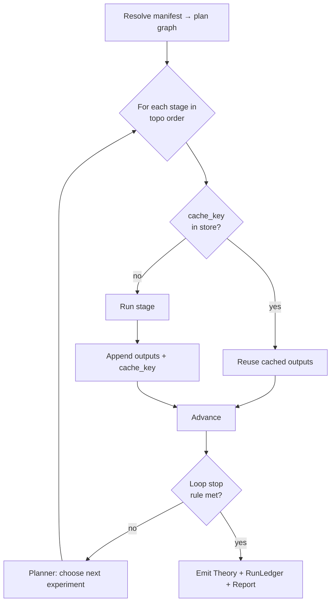
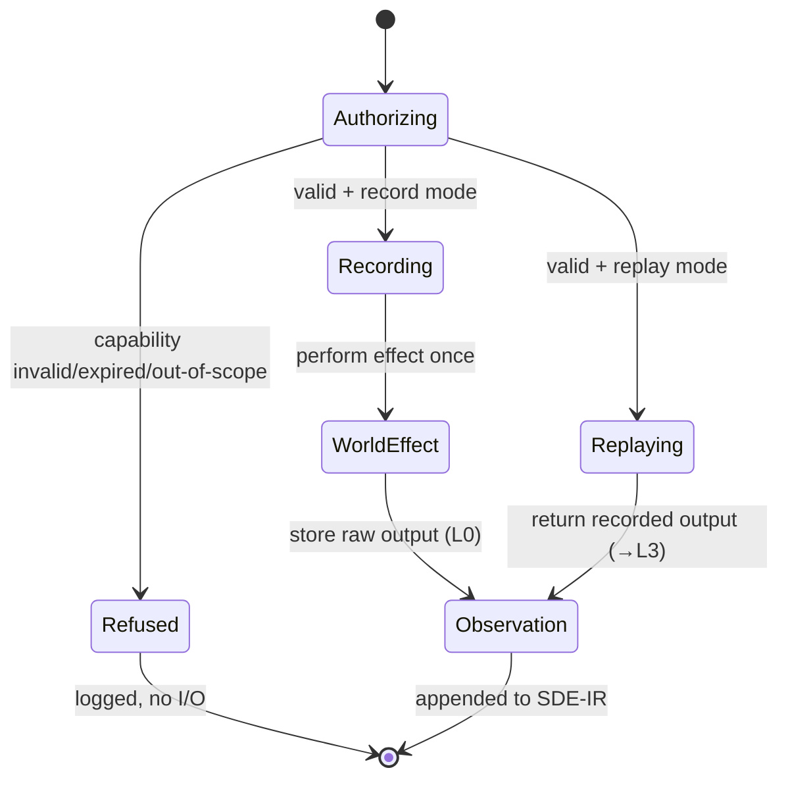

# 04 · Workflow Engine

> [← Object Model](./03-object-model.md) · [Information Theory →](./05-information-theory.md)

The workflow engine (`sde-workflow`) is the interpreter that runs the discovery
loop over the SDE-IR graph. Its job is to be a **reproducible build system whose
artifact is knowledge**: given a manifest and the current graph, decide what
must run, run only that, memoize the rest, cross the effect boundary safely, and
iterate until a stopping rule fires.

Rust below is illustrative sketch (see [03 preamble](./03-object-model.md)).

---

## 1. A stage is a pure pass over the graph

Every pipeline stage implements one shape: read some objects, produce some
objects, touch nothing else.

```rust
/// A pass over SDE-IR. Pure by contract; the ONLY impure stage is Execution,
/// which receives an `Executor` capability (§5) rather than doing I/O itself.
pub trait Stage {
    type In;   // the object types it reads
    type Out;  // the object types it appends

    /// Stable identity for the registry + reproducibility (name, semver, hash).
    fn descriptor(&self) -> StageDescriptor;

    /// Transform inputs into new objects. Deterministic given (inputs, seed, cfg).
    fn run(&self, input: Self::In, ctx: &StageCtx) -> Result<Self::Out, StageError>;
}
```

The ten canonical stages are the pipeline from the brief; each is a crate that
defines the *contract* and a default, and delegates heavy lifting to backend
plugins:

`Question → Hypothesis → Prediction → ExperimentDesign → Execution →
Observation → EvidenceExtraction → StatisticalEvaluation → Ranking →
TheoryRevision → Planning →` (loop).

> **Replaceability is structural.** Because a stage is just a `Stage` impl
> registered by descriptor, swapping "generate hypotheses by symbolic
> regression" for "generate hypotheses by LLM" is a registry entry, not a code
> change anywhere else — satisfying the brief's "every stage must be
> independently replaceable."

---

## 2. Workflows are declarative manifests

You do not script the engine imperatively; you *describe the study* and let the
engine resolve it — the Cargo.toml/CI-pipeline model, not the shell-script
model. A manifest pins every plugin and every version, so the run is
reproducible by construction.

```toml
# study.sde.toml  — illustrative
[study]
name    = "kepler-third-law"
question = "sde:study/kepler/Q0"     # root Question object (or inline)
domain  = "physics"                   # selects the domain frontend plugin
seed    = 0x5C12_3E70                 # mandatory — a study you can't reseed
                                      # isn't reproducible (bench-schema rule)

[stages.hypothesis]
plugin  = "sde-scirust/symreg@0.1.0"  # name + semver; the engine also pins its hash
config  = { pop = 512, gens = 80, max_size = 24, restarts = [1,2,3,4] }

[stages.prediction]
plugin  = "sde-scirust/symbolic-eval@0.1.0"

[stages.experiment_design]
plugin  = "sde-core/grid-design@0.1.0"
executor = "sim:local"                # which effect capability to use

[stages.statistics]
plugin  = "sde-scirust/stats@0.1.0"
config  = { test = "welch_t", alpha = 0.05 }

[stages.planner]
plugin  = "sde-core/eig-planner@0.1.0"
config  = { utility = "eig_per_cost", budget = { experiments = 20 } }

[loop]
stop = { any = [ "posterior_mass > 0.99", "budget_exhausted", "eig < 0.01 bits" ] }
```

The manifest resolves to a **plan graph** (which stages, over which objects,
with which plugins) that is itself hashed and stored as part of the
`RunLedger` — so "what was configured" is as immutable and citable as "what was
produced."

---

## 3. The scheduler: content-addressed, memoized, incremental

The engine treats a stage invocation as a pure function of its inputs, and
caches on the content address of those inputs — the Bazel/Nix model.

```
cache_key = hash( stage.descriptor    // name + version + plugin hash
                ⊕ input_object_ids     // the exact nodes consumed
                ⊕ config_hash          // the stage config
                ⊕ seed                 // the mandatory seed
                ⊕ env_digest )         // toolchain/backend/hardware class
```

- **If `cache_key` is already in the store, the stage does not run** — its
  outputs are returned from cache. Re-running an unchanged workflow is therefore
  nearly free and, more importantly, *provably* returns identical objects
  (Invariant IV). This is the same mechanism that gives reproducibility and
  incremental recompute — you get both from one design.
- **Change anything in the key and only the affected sub-DAG re-runs.** Edit one
  hypothesis-generation config and the engine recomputes hypotheses downstream
  but reuses every unrelated branch.
- **The scheduler is deterministic.** Ready stages run in a canonical order
  (topological, ties broken by `ObjectId`), so even the *schedule* is
  reproducible and recorded in the `RunLedger`. Parallel execution is allowed
  because stages are pure; determinism of results does not depend on execution
  order (this is exactly the guarantee `scirust-gpu`'s fixed-dispatch-order
  design provides one layer down).



---

## 4. The iteration controller & stopping rules

The discovery loop is a **fixpoint computation**: keep proposing and running
experiments until belief stabilizes or resources run out. The controller
(`sde-workflow` + `sde-planner`) evaluates the manifest's `stop` rule after each
iteration. Stopping rules are themselves explicit, composable objects:

| Rule | Meaning | Backed by |
|---|---|---|
| `posterior_mass > p` | one hypothesis has captured mass ≥ p | `sde-statistics` |
| `eig < ε bits` | no remaining experiment buys more than ε bits — **information is exhausted** | `sde-infotheory` |
| `budget_exhausted` | experiment count / compute / wall-cost cap hit | `sde-experiment` cost model |
| `contradiction_unresolved` | halt for human input on a live contradiction | `sde-theory` |
| `wall_time > t` / `converged(θ, tol)` | operational / numerical convergence | engine |

Rules compose with `any`/`all`. The **information-exhaustion** stop (`eig < ε`)
is the scientifically interesting one: the engine stops not when it is bored but
when *no available experiment can teach it more than ε bits*, and it can say so
with a number. This is what makes SDE a planner and not just a runner.

---

## 5. The effect boundary: Executors

`Execution` is the one stage that leaves the deterministic world. It never does
I/O itself; it receives an **`Executor` capability** and calls it. This
indirection is what makes physical experiments replayable.

```rust
pub trait Executor {
    /// Perform (or replay) the experiment, returning a recorded Observation.
    fn execute(&self, exp: &Experiment, auth: &Capability) -> Result<Observation, ExecError>;
    /// Declared determinism level of this executor's outputs (L0..L3).
    fn level(&self) -> DeterminismLevel;
}
```

Executor kinds:

| Executor | Level | Example |
|---|---|---|
| **Simulator** (in-process SciRust) | L2/L3 | run an ODE via `scirust-solvers`, a DSP pipeline via `scirust-signal` |
| **External compute** | L1/L2 | an HPC job, a GPU cluster, a remote solver |
| **Instrument / robot** | L0 | a wet-lab robot, a sensor rig, a telescope queue |
| **Market / live feed** | L0 | a quant backtest against recorded ticks (replay), or a live trade (record) |
| **Human** | L0 | a graded judgment, a manual measurement |

Two properties make this safe and reproducible:

1. **Record / replay (the "VCR").** In *record* mode the executor performs the
   effect once and stores the raw output as an immutable L0 `Observation`. In
   *replay* mode it returns that stored observation instead of touching the
   world. A replayed workflow is therefore **L3 from the observations down**,
   even if the original measurement was a one-shot physical event. This is the
   mechanism that reconciles "real experiments are irreproducible" with
   "workflows must reproduce."
2. **Capability authorization.** Performing a real effect requires a signed,
   time-boxed, least-privilege `Capability`, patterned directly on
   `scirust-discovery::ScopeAuthorization` (HMAC-signed, CIDR/protocol/
   time-scoped, refused-by-default outside scope). Every execution — permitted
   or refused — is written to the hash-chained ledger before any I/O, exactly as
   `scirust-discovery::DiscoveryEngine::probe_one` does. You cannot run an
   experiment the authorization did not cover, and you cannot run one without
   leaving a tamper-evident record.



---

## 6. The RunLedger: control flow is data too

Every run appends a `RunLedger` object recording: the resolved plan graph, the
schedule actually taken, every cache hit/miss, every executor authorization, the
environment digest, and the final stopping-rule evaluation. The ledger makes the
engine's *behavior* — not just its outputs — reproducible and auditable. "Why
did the engine run the assay before the RNA-seq?" is answered by the ledger, not
by re-deriving intent.

---

## 7. Failure, partiality, and resumption

- **Stages are transactional at the object level.** A failed stage appends a
  typed `Failure` object (with the error and its inputs) rather than corrupting
  the graph; the graph is always in a consistent, hash-valid state.
- **Resumption is free.** Because completed stages are memoized by content
  address, a crashed or paused run resumes by re-resolving the plan against the
  existing graph — everything already done is a cache hit. This is the same
  resume-from-cache property a good build system has.
- **Partial studies are valid studies.** A study that stopped early (budget,
  human halt) is a complete, citable sub-DAG; it simply has an open frontier the
  planner can extend later.

---

## 8. Why an engine, not a library of functions

One could imagine SDE as "just call these functions in order." The engine earns
its place because it provides four things a function-call chain cannot:

1. **Reproducibility as an invariant**, via content-addressed memoization and
   env capture — not as user discipline.
2. **A safe, recorded effect boundary**, so irreproducible experiments live
   inside reproducible workflows.
3. **Closed-loop iteration** driven by an information-theoretic planner with
   explicit stopping rules.
4. **A complete behavioral record** (`RunLedger`) that makes the *process*
   auditable, which is the crisis SDE exists to solve.

---

> [← Object Model](./03-object-model.md) · [Information Theory →](./05-information-theory.md)
