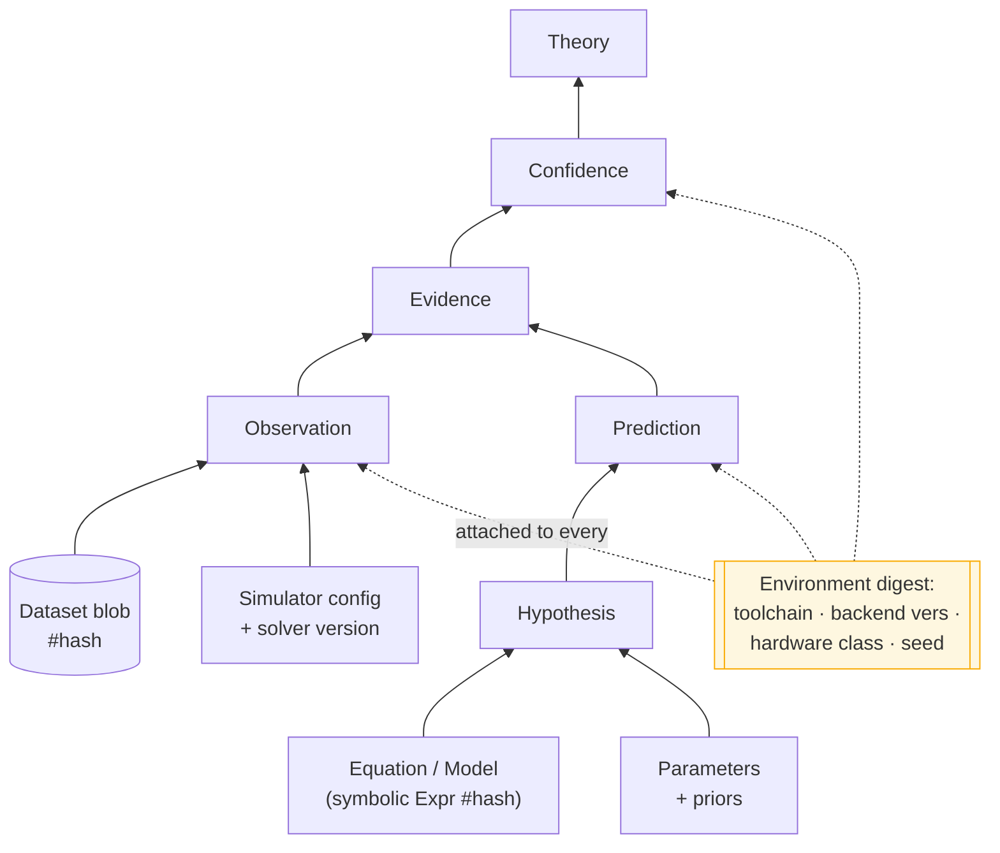
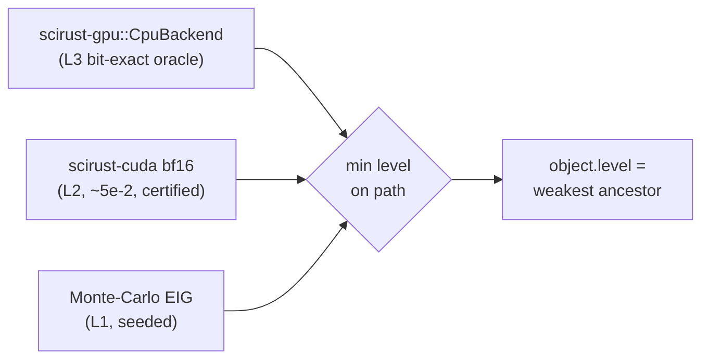

# 06 · Provenance & Reproducibility

> [← Information Theory](./05-information-theory.md) · [Extension API & Plugins →](./07-extension-api-and-plugins.md)

The brief's demand is absolute: *"Nothing should ever be lost. Every result must
be traceable to datasets, simulations, equations, parameters, solver versions,
compiler version, hardware metadata, random seeds,"* and *"Re-running an
identical workflow must reproduce identical outputs whenever deterministic
components are used."* This chapter specifies how `sde-provenance` and the
determinism machinery deliver exactly that.

---

## 1. Provenance is not a log — it is the graph

There is no separate "provenance system" bolted onto SDE; **provenance is the
edge set of SDE-IR itself.** Every object carries its `parents` and its
`producer` ([03 §1](./03-object-model.md#1-everything-is-a-scientific-object)),
so the complete lineage of any result is the transitive closure of parent edges
— computed, never reconstructed, and complete by construction.



"Why do we believe this theory?" is `ancestors(T)`. "What would break if this
dataset were retracted?" is `descendants(D)`. Both are graph traversals with
complete answers — the property the reproducibility crisis lacks.

---

## 2. The environment digest — the brief's traceability list, itemized

Every object that touches computation or the world carries a `ReproMeta`, whose
`env_digest` is a content hash of a fully-itemized environment record. The
brief's list maps one-to-one:

| Brief requires traceable to… | Captured in `ReproMeta` as | Source |
|---|---|---|
| **datasets** | content hash of each input data blob | `sde-store` blob refs |
| **simulations** | simulator plugin id + config hash + executor level | `Executor` descriptor |
| **equations** | symbolic model hash (`scirust_symbolic::Expr` canonical form) | `sde-hypothesis` |
| **parameters** | parameter/prior object hashes | `Hypothesis` body |
| **solver versions** | backend plugin name + semver + **plugin content hash** | plugin registry |
| **compiler version** | rustc + toolchain channel (this repo pins `rust-toolchain.toml`) | build-time capture |
| **hardware metadata** | hardware *class* (CPU/GPU model, ISA, BLAS backend) | runtime probe |
| **random seeds** | the mandatory `seed` (bench-schema rule) + RNG algorithm id | manifest / stage ctx |

```rust
pub struct ReproMeta {
    pub seed: u64,                     // mandatory — no reproducibility without it
    pub rng_algo: RngId,               // e.g. SplitMix64, PCG, XorShift64
    pub env_digest: Hash,              // hash of the EnvRecord below
    pub inputs: Vec<ObjectId>,         // dataset/param/equation content addresses
}

pub struct EnvRecord {               // hashed into env_digest, stored as a blob
    pub toolchain: ToolchainInfo,      // rustc/channel/target triple
    pub backends: Vec<BackendVersion>, // solver/BLAS/GPU plugin ids + semver + hash
    pub hardware: HardwareClass,       // ISA, CPU/GPU model, thread count, BLAS impl
    pub os: OsInfo,
}
```

**Seed discipline is inherited, not invented.** `scirust-bench-schema` already
makes `seed` a mandatory constructor argument — "a benchmark row whose
randomness cannot be reproduced is not a reproducible artifact." SDE promotes
that rule from benchmark rows to *every* object.

---

## 3. Determinism levels, propagated and certified

Reproducibility is meaningless as a boolean. SDE uses the four-level taxonomy
from [01 §6](./01-vision-and-philosophy.md#6-determinism-honestly-the-taxonomy)
(L3 bit-exact · L2 numeric-within-ε · L1 statistical · L0 recorded), and does
three things with it:

1. **Declare.** Every plugin declares the level it realizes. This is exactly
   `scirust-bench-schema::Certificate.determinism` (its `"D0".."D3"` field),
   reused verbatim so SDE and SciRust speak one vocabulary.
2. **Propagate.** An object's realized level is the **minimum** over its inputs
   and its producer. One L1 Monte-Carlo ancestor makes a whole downstream chain
   L1 — and the graph says so, rather than a README claiming "reproducible."
3. **Certify.** L2 objects carry a `Certificate` bounding the deviation
   (`bound_ulps`, a tolerance, or a `κ_rt` round-trip bound as in
   `scirust-core::certified_numerics`). The certificate is a checkable object,
   not a comment.

This is why the hash story and the determinism story cohere: L3/symbolic
payloads hash exactly; L2 payloads hash their **quantized** canonical form at
the certified precision and attach the certificate; L0 observations hash the
*recording*. Nothing pretends to be more reproducible than it is.



---

## 4. Signing & tamper-evidence

Content-addressing makes tampering *detectable* (change a byte, change every
descendant ID). Signing makes provenance *attributable and non-repudiable* —
"this object was produced by a build holding our key." SDE reuses
`scirust-provenance` / `scirust-license::hashsig` directly:

- **Merkle/Lamport signatures**, SHA-256 only, deterministic, no elliptic curve
  — the same offline signer (`MerkleSigner`) and public verifier
  (`verify_artifact` → `Verdict`) already in the workspace.
- **What it does**: gives an unforgeable proof that a *specific* object (or a
  published sub-DAG root) came from a trusted build; the per-signature `leaf`
  doubles as a serial for tracing which build produced it.
- **What it honestly does not do** (carried over verbatim from
  `scirust-provenance`'s own caveats): it does not stop someone re-deriving a
  result independently, and it is provenance/attribution, **not** an
  anti-clone shield. SDE inherits both the capability and the honesty.
- **Custody**: the secret seed never ships; signing is an offline step on a
  trusted host; published roots are timestamped to an external venue (a signed
  git tag, a transparency log) *before* distribution, so a root provably
  predates any suspect copy. (These are `scirust-provenance`'s production rules,
  adopted as SDE's.)

A `Publication` object is the natural thing to sign: it fixes a sub-DAG root,
and its signature lets any third party verify the whole study's integrity from
one 32-byte root.

---

## 5. Pre-registration is structural, not procedural

The strongest reproducibility property falls out of immutability for free.

An `Experiment` object contains its **analysis plan**, and it is hashed **before**
the `Observation` exists ([04 §5](./04-workflow-engine.md#5-the-effect-boundary-executors)).
Therefore:

- The analysis cannot be changed to fit the data — the data did not exist when
  the plan's hash was fixed. The hash *is* the pre-registration timestamp.
- Changing the plan after seeing data produces a *new* `Experiment` object with a
  *new* ID and a visible parent edge — a post-hoc reanalysis is allowed but is
  **transparently marked as one**, never disguised as the original.
- Every hypothesis considered and every analysis branch tried is a node, so the
  file-drawer is empty by construction: selective reporting shows up as an
  unreferenced subgraph anyone can traverse.

This repo already pre-registers by hand (`docs/research/ANEE_PHASE_D_PREREGISTRATION`).
SDE makes it a property of the type system: **you cannot p-hack an immutable,
pre-hashed plan.**

---

## 6. The reproducibility contract, stated precisely

> **Contract.** Given a `Publication` (or any object) `X`, an independent party
> who `clone`s its sub-DAG and re-runs the workflow obtains objects whose IDs
> match `X`'s **exactly at every L3 node**, **within the attached certificate at
> every L2 node**, **in distribution (given the recorded seed) at every L1
> node**, and **identically-by-replay at every L0 node**. Any deviation is
> localized to a specific node and its declared level — never a mystery.

That contract is checkable: `sde verify X` re-executes and diffs, reporting the
first node (if any) whose realized level or value violates its declaration. A
green `verify` is the machine-checkable form of "reproduced."

---

## 7. What "nothing is ever lost" costs, and how it is bounded

Total retention is not free; the design bounds it deliberately:

- **Dedup pays most of the bill.** Content-addressing means identical
  sub-results are stored once. Re-running a study that shares 90% of its DAG with
  a prior one stores only the 10% delta.
- **Large payloads are blobs, not inline.** Tensors/datasets are content-addressed
  side blobs referenced by hash (safetensors-style, as `scirust-sciagent` already
  does for checkpoints), so the object graph stays small and diffable.
- **GC is explicit and reachability-based.** Unreferenced dead-ends *can* be
  pruned, but only by an opt-in, logged GC from named refs — because a recorded
  dead-end is scientifically meaningful. "Nothing is lost by default" is the
  guarantee; "you may deliberately forget" is the escape hatch.

---

> [← Information Theory](./05-information-theory.md) · [Extension API & Plugins →](./07-extension-api-and-plugins.md)
