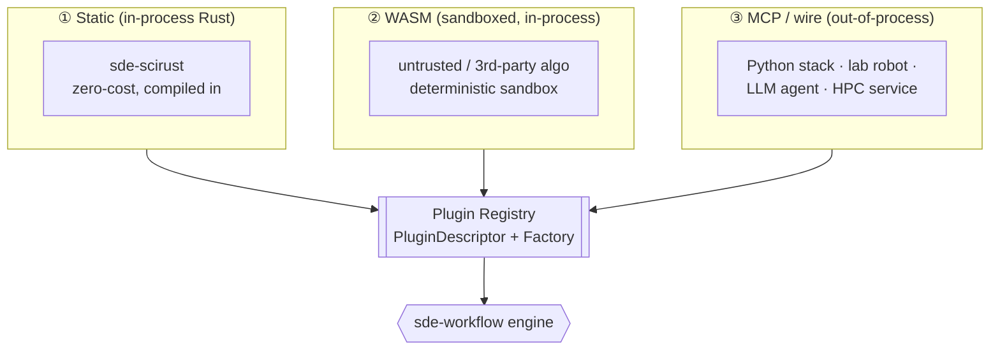

# 07 · Extension API & Plugin System

> [← Provenance & Reproducibility](./06-provenance-and-reproducibility.md) · [SciRust Integration →](./08-scirust-integration.md)

SDE is an *engine*, and an engine is only as good as what plugs into it. This
chapter defines the two extension surfaces — the **stage traits** (how you
replace a step of the pipeline) and the **Domain contract** (how you teach SDE a
new field) — the **registry** that binds them, and the three **plugin
mechanisms** (static Rust, WASM, MCP) that make backends swappable.

Rust below is illustrative sketch (see [03 preamble](./03-object-model.md)).

---

## 1. Two extension surfaces, deliberately separated

| Surface | Question it answers | Who implements it |
|---|---|---|
| **Stage traits** | "replace *how* a pipeline step is done" | backend/algorithm authors (e.g. `sde-scirust`) |
| **Domain contract** | "teach SDE a *new field* of science" | domain experts (physicist, quant, biologist) |

They compose: a `Domain` supplies the field-specific *types and defaults*; stage
plugins supply the field-agnostic *algorithms* that operate on them. A biologist
defines what a hypothesis and an observation *are* in their field; the
symbolic-regression plugin discovers laws over them without knowing it is doing
biology.

---

## 2. The stage-trait extension API

Each pipeline stage from the brief is a trait. Implementing one and registering
it replaces that step — nothing else in the system changes
([04 §1](./04-workflow-engine.md#1-a-stage-is-a-pure-pass-over-the-graph)).

```rust
pub trait HypothesisGenerator {
    fn generate(&self, q: &Question, ctx: &Ctx) -> Result<Vec<Hypothesis>, Err>;
}
pub trait Predictor {
    fn predict(&self, h: &Hypothesis, design: &Design, ctx: &Ctx) -> Result<Prediction, Err>;
}
pub trait ExperimentDesigner {
    fn design(&self, plan: &Plan, ctx: &Ctx) -> Result<Experiment, Err>;
}
pub trait Executor {                 // the effect boundary — see 04 §5
    fn execute(&self, e: &Experiment, cap: &Capability) -> Result<Observation, Err>;
    fn level(&self) -> DeterminismLevel;
}
pub trait EvidenceExtractor {
    fn extract(&self, o: &Observation, hs: &[Hypothesis], ctx: &Ctx) -> Result<Evidence, Err>;
}
pub trait StatisticalEvaluator {
    fn evaluate(&self, ev: &Evidence, belief: &BeliefState, ctx: &Ctx) -> Result<Confidence, Err>;
}
pub trait HypothesisRanker {
    fn rank(&self, c: &Confidence) -> Result<Ranking, Err>;
}
pub trait Planner {                  // see 05 §6
    fn recommend(&self, b: &BeliefState, d: &DesignSpace, u: &dyn UtilityPolicy, bud: &Budget) -> Plan;
}
pub trait TheoryReviser {
    fn revise(&self, t: &Theory, c: &Confidence) -> Result<Revision, Err>;
}
```

Two supporting policy traits are extension points in their own right:

```rust
pub trait UtilityPolicy { fn utility(&self, eig: Estimate, cost: &Cost) -> f64; }   // 05 §3
pub trait InfoGain      { fn eig(&self, d: &DesignCandidate, b: &BeliefState, t: Target) -> Estimate; } // 05 §2
```

Every trait method is **pure** (except `Executor`, which is the sanctioned
effect boundary and takes a capability). Purity is what lets the engine memoize,
parallelize, and reproduce ([04 §3](./04-workflow-engine.md#3-the-scheduler-content-addressed-memoized-incremental)).

---

## 3. The Domain contract — one small trait to enter a field

The brief's core requirement: *"The only requirement is that a domain provides
hypotheses, predictions, observations, and evaluation."* That is literally the
`Domain` trait — a **bundle** that a field implements once. Everything else in
SDE is domain-agnostic and reuses it.

```rust
pub trait Domain {
    /// The field's natural representations (physics: SI quantities & ODEs;
    /// finance: price paths & P&L; ML: datasets & metrics; …). Kept as
    /// associated types so each field keeps its own vocabulary.
    type Design;
    type Observable;
    type ModelRepr: Model<Design = Self::Design, Observable = Self::Observable>;

    /// (1) HYPOTHESES — how this field proposes candidate models for a question.
    fn hypothesis_space(&self, q: &Question) -> HypothesisSpace<Self::ModelRepr>;

    /// (2) PREDICTIONS — how a model maps a design to an expected observable.
    ///     (Usually delegates to ModelRepr::predict; here for field-level priors.)
    fn predict(&self, m: &Self::ModelRepr, d: &Self::Design, ctx: &Ctx) -> Prediction<Self::Observable>;

    /// (3) OBSERVATIONS — how raw executor output becomes a typed Observable,
    ///     and the field's default Executor(s) (a simulator, an instrument…).
    fn observe(&self, raw: &RawOutput) -> Result<Observation<Self::Observable>, Err>;
    fn executors(&self) -> Vec<Box<dyn Executor>>;

    /// (4) EVALUATION — the field's likelihood / goodness-of-fit of an
    ///     observation under a model (the term that drives Bayes updating).
    fn likelihood(&self, obs: &Observation<Self::Observable>, m: &Self::ModelRepr) -> LogLikelihood;
}
```

That is the entire onboarding cost of a new science. Provide those four things
and you inherit — for free — the object model, hashing, provenance,
reproducibility, the workflow engine, the information-theoretic planner,
ranking, contradiction detection, reporting, and every stage plugin ever written.
The brief's domain list (mathematics, optimization, signal processing, AI, ML,
finance, biology, chemistry, quantum simulation, engineering, robotics) is a
list of `Domain` implementations, and [08 §4](./08-scirust-integration.md#4-domain-map-which-scirust-crates-power-which-field)
maps each to the SciRust crates that make it cheap to write.

---

## 4. The registry & capability descriptors

Plugins are not linked by name at the type level — they are **registered** and
looked up by a stable key, exactly like an LLVM pass registry. This indirection
is what makes stages and backends swappable and what keeps runs reproducible.

```rust
pub struct PluginDescriptor {
    pub name: PluginName,          // "sde-scirust/symreg"
    pub version: SemVer,           // 0.1.0
    pub content_hash: Hash,        // hash of the plugin artifact itself
    pub implements: StageKind,     // HypothesisGenerator, Planner, …
    pub level: DeterminismLevel,   // the level it declares (01 §6)
    pub capabilities: CapSet,      // e.g. needs_network, needs_gpu, effectful
    pub domains: Vec<DomainTag>,   // fields it applies to (or "any")
}

pub trait Registry {
    fn register(&mut self, d: PluginDescriptor, factory: Factory);
    fn resolve(&self, name: &PluginName, req: &VersionReq) -> Option<Bound>;  // name + semver
    fn find(&self, kind: StageKind, domain: DomainTag) -> Vec<PluginDescriptor>;
}
```

Three properties matter:

- **Content-pinned reproducibility.** A manifest references a plugin by
  `name@semver`, and the engine records its `content_hash` in the `RunLedger`.
  A rerun that resolves a *different* hash for the same name is a detected drift,
  not a silent substitution.
- **Capability-gated safety.** `capabilities` declares what a plugin needs
  (network, GPU, filesystem, "effectful"). The engine refuses to run a plugin
  outside the study's granted capabilities — the same least-privilege posture as
  `scirust-discovery::ScopeAuthorization`.
- **Discovery.** `find(kind, domain)` powers `sde plugins list` and lets the
  planner enumerate, e.g., every `HypothesisGenerator` valid for `chemistry`.

---

## 5. Three plugin mechanisms (one registry, three transports)

Backend-agnosticism requires that a plugin can be Rust, another language, or a
sandbox. All three register identically and produce the same objects; they
differ only in *transport* and *trust*.



| Mechanism | Trust / isolation | Determinism | Use | SciRust tie-in |
|---|---|---|---|---|
| **① Static Rust** | full trust, in-process, zero-cost | inherits the impl's level (up to L3) | the default; `sde-scirust` and all first-party stages | direct crate calls |
| **② WASM component** | sandboxed, no ambient authority, in-process | strong — a WASM sandbox with no clock/RNG/FS is a natural **L3** box for third-party code | untrusted or community algorithms; hermetic reproducibility | compile a SciRust routine to WASM for a portable, pinned backend |
| **③ MCP / wire** | out-of-process, capability-scoped | as declared by the remote (often L0/L1) | non-Rust stacks, lab hardware, LLM agents, remote HPC | reuse **`scirust-mcp`** as the transport; `scirust-sciagent`'s `Tool`/`ToolResult` ABI is a ready-made agent-plugin shape |

The MCP path deserves emphasis because it is what makes SDE genuinely
polyglot and what closes the loop with this workspace's existing agent stack:

- **SDE *consumes* MCP tools as plugins.** A Python analysis, a wet-lab robot
  controller, or a remote solver exposes itself over MCP; SDE wraps it as an
  `Executor` or a stage plugin. This is how "backend-agnostic" reaches beyond
  Rust.
- **SDE *exposes itself* over MCP** (`sde-mcp`). Then `scirust-sciagent` — or any
  external LLM agent — can drive the whole pipeline as a set of typed tools
  ("propose hypotheses", "plan next experiment"), while the DAG keeps every
  agent action honest, recorded, and reproducible. The agent becomes a
  *hypothesis generator with provenance*, not an oracle.

---

## 6. Versioning, discovery, and the stability contract

- **Semantic versioning on every plugin**; the trait surface in
  `sde-core`/`sde-registry` is the stable ABI and changes only by SDE-RFC
  ([01 §8](./01-vision-and-philosophy.md#8-governance--stability)).
- **A plugin's outputs are pinned to its version + hash.** An object produced by
  `symreg@0.1.0` is forever attributable to that exact artifact, even after
  `0.2.0` ships. Upgrading a plugin never rewrites old objects; it only affects
  new work.
- **Discovery is first-class**: `sde plugins find --stage hypothesis-generator
  --domain chemistry` lists candidates with their declared levels and
  capabilities, so choosing a backend is an informed, recorded decision.

---

## 7. Why this is enough to be "the LLVM of discovery"

LLVM's leverage came from a stable IR plus a pass/target registry, so languages
and chips compose without knowing about each other. SDE's leverage is the same
shape: a stable object model (SDE-IR) plus a stage/domain/backend registry, so a
new **field** (frontend), a new **algorithm** (pass), and a new **compute
substrate** (backend) each enter independently. A physicist writing a `Domain`
never touches the planner; a numerics author writing a faster `Predictor` never
touches biology; a lab wiring up a robot `Executor` never touches statistics.
That mutual independence — enforced by the registry indirection and the
downward-only dependency graph — is the whole game.

---

> [← Provenance & Reproducibility](./06-provenance-and-reproducibility.md) · [SciRust Integration →](./08-scirust-integration.md)
