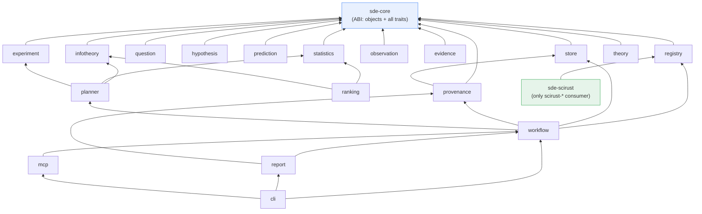

# 09 · Workspace & Crates

> [← SciRust Integration](./08-scirust-integration.md) · [Roadmap, Risks & Future →](./10-roadmap-risks-future.md)

This chapter fixes the concrete deliverable: the `sde-*` workspace layout, each
crate's responsibility and dependencies, how it deviates from (and improves on)
the brief's crate list, and the one hard naming constraint.

---

## 1. Workspace shape

SDE is a **separate Cargo workspace** with its own root manifest, living at
`sde/` in this monorepo (a sibling to the SciRust crates) so it can dogfood
against SciRust via path dependencies, while remaining independently
publishable. It consumes SciRust as ordinary dependencies of the *one* adapter
crate (`sde-scirust`); no other SDE crate names a `scirust-*` crate. That single
choke point is what keeps "backend-agnostic" true in the build graph, not just
in prose.

```
sde/
├── Cargo.toml                 # [workspace] — the SDE members below
├── sde-core/                  # substrate: objects, traits, hashing, determinism
├── sde-store/                 # content-addressed object store
├── sde-provenance/            # provenance DAG, env capture, signing
├── sde-registry/              # plugin & capability registry, WASM/MCP loaders
├── sde-question/              # the Question stage + object
├── sde-hypothesis/            # hypothesis space, priors, Model wrappers
├── sde-prediction/            # prediction stage
├── sde-experiment/            # experiment design + cost model
├── sde-observation/           # observation + Executor kinds
├── sde-evidence/              # evidence extraction
├── sde-statistics/            # Bayesian core, tests, model comparison
├── sde-infotheory/            # EIG, utility, entropy, discrimination   (NEW)
├── sde-ranking/               # hypothesis ranking
├── sde-theory/                # theory, revision, contradiction         (NEW)
├── sde-planner/               # next-experiment recommendation
├── sde-workflow/              # the engine: schedule · memoize · replay · loop
├── sde-report/                # publication, executable paper
├── sde-scirust/               # THE SciRust adapter (the only scirust-* consumer)
├── sde-mcp/                   # expose SDE over MCP + consume MCP plugins  (NEW)
└── sde-cli/                   # the `sde` binary (git-style porcelain)     (NEW)
```

---

## 2. Crate responsibilities

Grouped by the architecture layers of [02 §2](./02-architecture.md#2-the-layered-architecture).
"Depends on" lists **SDE** dependencies only (all also depend on `sde-core`).

### Substrate layer (the stability surface)

| Crate | Responsibility | Depends on |
|---|---|---|
| **sde-core** | The `Object<B>` envelope; `Kind`/schema versions; `ObjectId`, canonical serialization, deterministic hashing (`Hashable`); `DeterminismLevel`; `ReproMeta`; **all stage traits, the `Domain` trait, the `Model` trait**; error types. This is the ABI everything else pins to. | — |
| **sde-store** | Content-addressed object store: `put`/`get`/`has`, packing, GC from named refs, blob side-storage; local + object-storage backends. | core |
| **sde-provenance** | Provenance-DAG helpers; `ReproMeta`/`EnvRecord` capture; Merkle/Lamport **signing & verification** (wraps `scirust-provenance`). | core, store |
| **sde-registry** | `PluginDescriptor`, capability descriptors, `Registry`; the static/WASM/MCP plugin loaders; version + content-hash resolution. | core |

### Reasoning layer (the passes — thin contracts + defaults)

| Crate | Responsibility | Depends on |
|---|---|---|
| **sde-question** | `Question` object + authoring/decomposition stage. | core |
| **sde-hypothesis** | `HypothesisSpace`, priors, `Model` wrappers; `HypothesisGenerator` contract + a trivial default. | core |
| **sde-prediction** | `Predictor` contract; prediction-with-uncertainty plumbing. | core |
| **sde-experiment** | `Experiment` object, the **cost model**, `ExperimentDesigner` contract, pre-registration hashing. | core |
| **sde-observation** | `Observation` object; `Executor` trait + record/replay; capability authorization. | core |
| **sde-evidence** | `EvidenceExtractor` contract; reduction of observations to hypothesis-relevant quantities. | core |
| **sde-statistics** | The Bayesian core: `BeliefState`, marginal likelihood, Bayes factors, frequentist tests; `StatisticalEvaluator` contract. | core |
| **sde-infotheory** *(new)* | EIG/BOED estimators, `UtilityPolicy`, entropy, hypothesis discrimination. Split out of the brief's `sde-planner` (see §3). | core |
| **sde-ranking** | `HypothesisRanker`; posterior-ordering + reporting. | statistics, infotheory |
| **sde-theory** *(new)* | `Theory`, `Revision`, `Contradiction`; theory-revision stage; symbolic + dimensional contradiction detection. Fills a gap in the brief (see §3). | core |

### Orchestration layer

| Crate | Responsibility | Depends on |
|---|---|---|
| **sde-planner** | `Planner`: recommend the next experiment; stopping-rule evaluation. Pure decision logic over `sde-infotheory` estimates. | infotheory, statistics, experiment |
| **sde-workflow** | The engine: manifest resolution, the content-addressed scheduler, memoization, the effect boundary, the iteration controller, the `RunLedger`. | registry, store, provenance, planner |

### Interface & backend layers

| Crate | Responsibility | Depends on |
|---|---|---|
| **sde-report** *(≈ brief's report)* | `Publication` objects; render a sub-DAG to a paper/notebook where **every figure re-executes from its node** ("executable paper"); signs the publication root. | workflow, provenance |
| **sde-scirust** | The default backend adapter — implements the reasoning-layer traits by calling SciRust crates ([08](./08-scirust-integration.md)). The **only** crate that depends on `scirust-*`. | registry (+ `scirust-*`) |
| **sde-mcp** *(new)* | Expose SDE as MCP tools (for `scirust-sciagent`/external agents) **and** consume MCP servers as plugins; wraps `scirust-mcp`. | workflow, registry |
| **sde-cli** *(new)* | The `sde` binary: `init`, `clone`, `run`, `plan`, `verify`, `log`, `diff`, `merge`, `plugins`, `report` — the git-style porcelain over the plumbing crates. | workflow, report, mcp |

---

## 3. Deviations from the brief (and why)

The brief invited reorganization ("Feel free to reorganize this if a better
architecture exists"). Five deliberate changes:

| Change | From brief | To | Rationale |
|---|---|---|---|
| **Split information theory out of the planner** | (folded into `sde-planner`) | new **`sde-infotheory`** + slimmer `sde-planner` | The brief names information theory a *major objective* with four sub-capabilities (EIG, utility, uncertainty reduction, discrimination). Those are reusable by `sde-ranking`, `sde-experiment`, and stopping rules — not just the planner. Keeping estimation (`infotheory`) separate from decision (`planner`) is the same clean split as "cost function vs. optimizer." |
| **Add a theory crate** | (no crate; brief has "Theory Revision" as a *stage* and asks to "detect contradictions") | new **`sde-theory`** | `Theory`, `Revision`, `Publication` are first-class objects in the brief's own object list, and contradiction detection needs a home. It was the one object cluster with no crate. |
| **Add store + registry** | (implicit) | new **`sde-store`**, **`sde-registry`** | Content-addressed storage and the plugin registry are the mechanisms that *make* the brief's reproducibility and extensibility requirements real. They deserve to be explicit, testable crates, not hidden inside `sde-core`. |
| **Add CLI + MCP** | (implicit) | new **`sde-cli`**, **`sde-mcp`** | To be "the Git of discovery" there must be a `git`-shaped CLI; to be backend-agnostic and agent-drivable there must be an MCP seam. Both are interface crates, cleanly above the engine. |
| **Traits live in `sde-core`, not per-stage** | (per-stage crates implied to own their traits) | all stage/`Domain`/`Model` traits in **`sde-core`** | Putting the extension ABI in one crate is what lets `sde-scirust` implement every stage without depending on ten separate crates, and lets the stability contract cover one surface. The per-stage crates own *objects + defaults*, not the trait definitions. |

Everything else maps one-to-one to the brief's list, with `sde-provenance`,
`sde-statistics`, `sde-workflow`, `sde-report`, and `sde-scirust` keeping their
names and intent.

---

## 4. Naming and the `scirust-discovery` collision

**This is a hard constraint, not a preference.** The SciRust workspace already
contains a crate named `scirust-discovery` — but it means *OT/IT network asset
discovery* (protocol-native, Nmap-safe probing of industrial devices under a
signed `ScopeAuthorization`), **not** scientific discovery. It is unrelated to
SDE.

Consequences, adopted throughout this design:

- SDE uses the **`sde-*`** crate namespace exclusively. There is no
  `scirust-discovery`-named SDE crate and no attempt to rename the existing one.
- Where SDE reuses `scirust-discovery`'s *ideas* — the signed, time-boxed,
  least-privilege `ScopeAuthorization` and the hash-chained audit log — it does
  so by pattern, in `sde-observation`'s capability model
  ([04 §5](./04-workflow-engine.md#5-the-effect-boundary-executors)), not by
  depending on that crate.
- Prose in this repo should say "**SDE**" or "the Scientific Discovery Engine"
  and reserve "discovery" unqualified for the existing network crate's domain,
  to keep the two unambiguous.

---

## 5. Dependency-graph invariants (enforced, not hoped)

Three rules keep the workspace healthy and the "swappable backend" promise real:

1. **`sde-core` is the universal sink.** It depends on no other SDE crate; every
   other SDE crate depends on it. (Enforceable in CI with a dependency-lint.)
2. **No reasoning crate depends on another reasoning crate by type** (only
   through `sde-core` traits and SDE-IR objects), except the two documented
   composition edges `ranking → {statistics, infotheory}` and
   `planner → {infotheory, statistics, experiment}`. This is what makes stages
   independently replaceable.
3. **`scirust-*` appears in exactly one SDE crate** (`sde-scirust`). A
   dependency-lint fails the build if any other SDE crate names a `scirust-*`
   dependency — the mechanical guarantee of backend-agnosticism.



---

## 6. Crate count & granularity rationale

Twenty-one crates is more than a hobby project needs and about right for
infrastructure. The granularity is chosen so that (a) the **stability surface**
is one crate (`sde-core`), (b) each **pipeline stage** is independently
versioned and replaceable, (c) the **backend seam** is a single crate that can
be forked per-backend, and (d) **interface concerns** (CLI, MCP, report) are
above the engine and cannot leak into it. A smaller crate could merge the thin
reasoning crates, but doing so would couple stages the brief explicitly wants
independently replaceable — the granularity *is* the "every stage is replaceable"
requirement, expressed in Cargo.

---

> [← SciRust Integration](./08-scirust-integration.md) · [Roadmap, Risks & Future →](./10-roadmap-risks-future.md)
