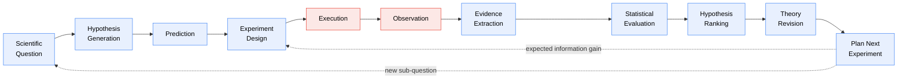

# Scientific Discovery Engine (SDE)

> A deterministic, reproducible, extensible framework for orchestrating the
> **entire** scientific discovery loop — from an initial question to a
> validated, versioned theory — with SciRust as its primary (but not
> exclusive) computational backend.

**Status:** Architecture proposal / RFC-0001. No implementation yet — this
directory is the design document. See [Non-goals](#non-goals-for-v1) and the
[Roadmap](./10-roadmap-risks-future.md).

> **SDE is now one subsystem of a larger architecture.** The [Scientific
> Operating System (SOS), RFC-0002](../sos/README.md) makes SDE its *Discovery
> Engine* and promotes this RFC's `sde-core` substrate into the SOS kernel
> (`sos-core`). This document stands as the definitive spec of the discovery
> loop; SOS references it rather than repeating it.

---

## The one-paragraph pitch

Modern science runs on an undocumented pipeline: a question becomes hypotheses,
hypotheses become predictions, predictions become experiments, experiments
become observations, observations become evidence, evidence updates belief, and
belief chooses the next experiment. Today that pipeline lives in lab notebooks,
spreadsheets, ad-hoc scripts, and human memory — **none of it reproducible, none
of it versioned, none of it composable.** SDE makes that pipeline a
first-class, executable object: every stage is a typed, replaceable component;
every intermediate result is an immutable, content-addressed, deterministically
hashed object with full provenance; every workflow is a DAG that re-runs to
identical outputs; and an information-theoretic planner recommends the
experiment that maximises expected information gain per unit cost. If Git made
source history reproducible and LLVM made compilation retargetable, SDE aims to
make **discovery itself** reproducible and retargetable.

---

## The pipeline SDE makes executable

Blue stages are **pure and reproducible**. Red stages (`Execution`,
`Observation`) are the *only* boundary where the engine touches the outside
world — a simulator, a lab instrument, a market feed, a human. SDE records what
crosses that boundary so a replay reproduces the whole loop deterministically.
Every stage is independently replaceable.

---

## The three analogies that define the design

| Borrowed idea | From | What SDE takes |
|---|---|---|
| **Content-addressed immutable DAG** of objects; branch, diff, merge; a porcelain/plumbing CLI split | **Git** | Discovery becomes a versioned object graph. Competing research lines are branches; reconciling them is a merge; a lab's whole history is `clone`-able and re-runnable. |
| **A stable intermediate representation** with pluggable *frontends* (domains) and *backends* (compute), and a **pass registry** that transforms the IR | **LLVM** | The discovery graph is *SDE-IR*. Domains are frontends; SciRust/Python/HPC/lab are backends; pipeline stages are passes registered by name + version. |
| **Hermetic, content-addressed, memoized builds** → reproducible outputs | **Nix / Bazel** | A stage whose inputs, seed, and environment are unchanged returns a cached result. Reproducible discovery *is* a hermetic build whose artifact happens to be knowledge. |

---

## Document map

Read in order for the full argument, or jump to a concern.

| # | Document | Answers |
|---|---|---|
| 00 | **README** (this file) | What is SDE, why, and where do I start? |
| 01 | [Vision & Philosophy](./01-vision-and-philosophy.md) | Why build this, for whom, and the non-negotiable invariants. |
| 02 | [Architecture Overview](./02-architecture.md) | The layers, SDE-IR, control/data flow, the discovery DAG. |
| 03 | [Object Model](./03-object-model.md) | The scientific objects, the common envelope, IDs, hashing, serialization, versioning. |
| 04 | [Workflow Engine](./04-workflow-engine.md) | Stages, the declarative manifest, scheduler, memoization, the effect boundary, iteration & stopping. |
| 05 | [Information Theory & Planning](./05-information-theory.md) | Expected information gain, experiment utility, uncertainty reduction, hypothesis discrimination. |
| 06 | [Provenance & Reproducibility](./06-provenance-and-reproducibility.md) | The provenance DAG, environment capture, signing, determinism levels, pre-registration. |
| 07 | [Extension API & Plugin System](./07-extension-api-and-plugins.md) | The stage traits, the Domain contract, the registry, static/WASM/MCP plugins. |
| 08 | [SciRust Integration](./08-scirust-integration.md) | The `sde-scirust` adapter, stage→crate and domain→crate maps, other backends. |
| 09 | [Workspace & Crates](./09-workspace-and-crates.md) | Every crate, its responsibility, the dependency graph, deviations from the brief. |
| 10 | [Roadmap, Risks & Future Research](./10-roadmap-risks-future.md) | Phased delivery, honest risks with mitigations, research directions. |

A one-page terminology and object catalog lives at the end of
[03-object-model.md](./03-object-model.md#appendix-object-catalog-quick-reference).

---

## Why this repo, specifically

SDE is not speculative for SciRust — **this workspace already runs the loop by
hand.** Under [`docs/kb/`](../kb/) there is a real, `run_id`-keyed pass through
the exact pipeline: `questions/` (topic init, problem decomposition, hypothesis
generation), `literature/` (collect → screen → extract), `experiments/`
(codebase search, resource planning), `findings/` (synthesis), `decisions/`
(experiment design). Each file already carries an `id`, a `run_id`, a `stage`,
and an `evidence:` list in its front-matter. That *is* the SDE object envelope —
written by a human, unhashed, unversioned, un-replayable.

Likewise, [`docs/research/`](../research/) contains pre-registered studies
(e.g. `ANEE_PHASE_D_PREREGISTRATION`), the `scirust-bench-schema` crate already
enforces "a benchmark record is a type with a **mandatory seed**," and
`scirust-provenance` already does deterministic Merkle/Lamport signing of
artifacts. SDE's job is to **turn these conventions into a typed, hashed,
executable substrate** — and to make the first thing it reproduces be SciRust's
own research history. That is the dogfooding target for Milestone 1.

---

## Non-goals (for v1)

SDE is deliberately *not* several things, so the scope stays honest:

- **Not a numerical library.** It orchestrates backends; it does not
  re-implement solvers, BLAS, or statistics. SciRust does that.
- **Not an oracle of truth.** It cannot tell you a model is *correct* — only
  that your reasoning over it was consistent, reproducible, and fully recorded.
  Garbage priors in, garbage posteriors out; SDE's contribution is that the
  garbage is now *explicit, versioned, and auditable.*
- **Not an autonomous scientist.** LLM-driven hypothesis generation is *a
  plugin*, kept honest by the DAG. A human (or a policy) remains the gate.
- **Not tied to physics, or to Rust user code.** Any domain that can supply
  hypotheses, predictions, observations, and an evaluation plugs in — in Rust,
  over WASM, or over MCP.

---

## License & contribution

SDE inherits the SciRust workspace conventions (see the repository root
`LICENSE.md` / `LICENSING.md`). Design discussion happens by PR against this
directory; the object model and extension traits are the stability surface and
change under the RFC process described in
[01-vision-and-philosophy.md](./01-vision-and-philosophy.md#governance--stability).
