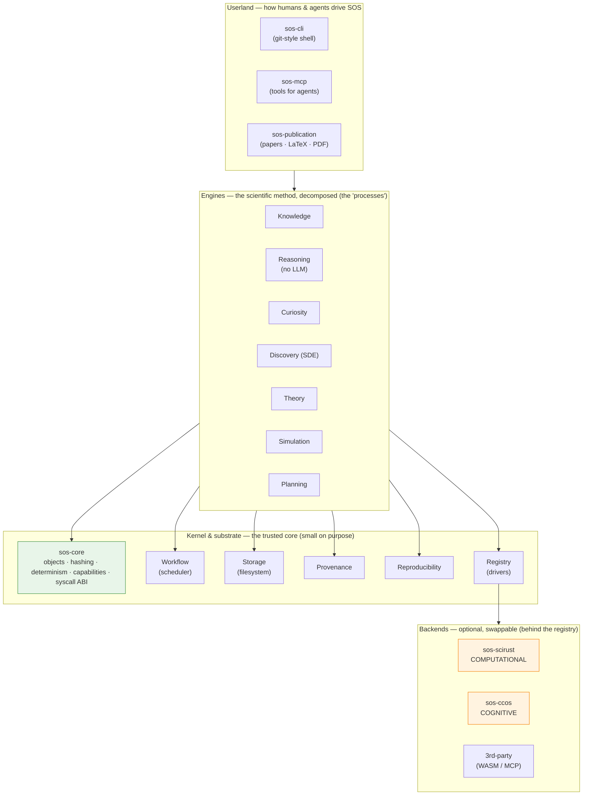
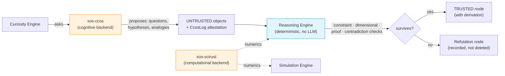
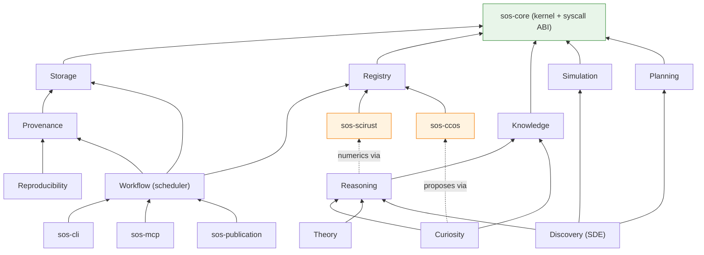

# 02 · System Architecture

> [← Vision & Principles](./01-vision-and-principles.md) · [Object Model →](./03-object-model.md)

Rust in this RFC is **illustrative, non-normative sketch** — signatures that fix
the design's shape, not an implementation.

---

## 1. The kernel / engine / userland / backend split

SOS is layered like an operating system, and the layering is load-bearing: it is
what keeps the trusted core small, the engines independently replaceable, and the
backends swappable.



- **Kernel (`sos-core` + substrate).** The trusted computing base: the object
  model, content-addressing, the determinism taxonomy, capabilities, and the
  **engine trait ABI** (the "system calls"). Small by design — the smaller the
  kernel, the stronger every guarantee above it. This is the promotion of the SDE
  RFC's `sde-core` to OS scope.
- **Engines (the processes).** Each engine is the scientific method's decomposition
  into one replaceable concern. They talk only through kernel traits and by
  reading/writing the object DAG — never to each other by type.
- **Userland.** The shell (`sos-cli`), the agent interface (`sos-mcp`), and the
  publication surface. Where humans and external agents issue work.
- **Backends (the drivers).** SciRust (compute) and CCOS (cognition) are the
  preferred drivers, reached only through the registry. Optional and swappable
  by Invariant VIII.

**Dependencies point strictly inward/downward.** Userland → engines → kernel →
(via registry) backends. No engine depends on another engine's crate; no kernel
crate depends on a backend. That acyclic, inward-only shape is the whole reason a
subsystem can be replaced without disturbing the rest.

---

## 2. The syscall ABI — how a subsystem asks for work

An OS exposes a stable, small set of system calls. SOS's equivalent is the set of
**engine traits in `sos-core`**: the only vocabulary through which engines,
userland, and plugins request each other's services. They are the stability
surface ([01 §5](./01-vision-and-principles.md#5-governance--the-rfc-process)).

```rust
// The engine "syscalls" — each is implemented by an engine crate and/or a
// backend plugin, resolved through the registry. All are pure except Execute.
pub trait Knowledge   { fn query(&self, q: &KnowledgeQuery) -> KnowledgeView; 
                        fn assert(&self, facts: &[Node]) -> Result<Vec<ObjectId>, Err>; }
pub trait Reason      { fn derive(&self, goal: &Goal, kb: &KnowledgeView) -> Derivation; }   // + explanation
pub trait BeCurious   { fn propose(&self, kb: &KnowledgeView, budget: &Budget) -> Vec<Question>; }
pub trait Simulate    { fn run(&self, sim: &Simulation, cap: &Capability) -> Observation; }   // effectful
pub trait Plan        { fn recommend(&self, belief: &BeliefState, space: &DesignSpace) -> Plan; }
pub trait Publish     { fn render(&self, root: ObjectId, fmt: Format) -> Artifact; }
pub trait Remember    { fn store(&self, o: &Object) ; fn recall(&self, q: &Recall) -> Vec<ObjectId>; } // cognitive
```

Two properties make this an *ABI* and not just a pile of traits:

- **Content-pinned resolution.** A caller requests a capability by name + semantic
  version; the registry binds it and records the plugin's content hash in the run
  ledger, so a rerun that resolves a different implementation is a *detected
  drift* ([10 §1](./10-plugins-backends-interfaces.md#1-the-plugin-interface)).
- **Capability-gated effects.** The one effectful syscall (`Simulate::run`) takes
  a signed, time-boxed `Capability`; every other syscall is pure and therefore
  memoizable and reproducible.

---

## 3. Data plane vs. control plane

Like an OS, SOS separates *what exists* from *what is happening*.

- **Data plane — the object DAG (SOS-IR).** Append-only, content-addressed,
  monotonic. Questions, knowledge nodes, hypotheses, experiments, evidence,
  theories, derivations — all immutable objects, related by provenance edges.
  This is the reproducible substrate; it only ever grows.
- **Control plane — the workflow schedule.** Which engine runs when, what it
  reads, whether a cached result is reused, when the Curiosity loop fires. Derived
  from a manifest and the current DAG, and itself recorded as a `RunLedger`
  object — so "what the OS did" is as reproducible as "what exists."

The Workflow Engine ([08](./08-workflow-and-simulation.md)) is the scheduler over
the data plane, exactly as the SDE workflow engine is; SOS generalizes it to
schedule *all* engines, not only the discovery stages.

---

## 4. The two backends and the propose/verify data flow

The single most important flow in SOS is how a **cognitive proposal** becomes a
**trusted conclusion**. It embodies Invariant IX and is what lets SOS use an
LLM-backed memory without an LLM in its reasoning.



1. The **cognitive backend** (CCOS, or `scirust-sciagent`) *proposes*. Its output
   is an **untrusted** object, and the proposal is **attested** — CCOS is itself a
   causal-context OS with a hash-chained event log (`CcosLog`:
   `input_hash → output_hash → chain_hash`), which SOS anchors into provenance.
2. The **deterministic Reasoning Engine** independently checks the proposal:
   dimensional consistency (`scirust-units`), symbolic equivalence/contradiction
   (`scirust-symbolic::prove_equal`), logical entailment (`neuro-symbolic`
   Datalog/SAT/e-graph), causal soundness (`CausalEngine`).
3. Only what **survives** becomes a trusted node — and it carries the derivation
   that justifies it. What fails becomes a recorded `Refutation`, never a silent
   deletion.
4. The **computational backend** (SciRust) supplies numerics to the Reasoning and
   Simulation engines — solvers, statistics, GP, signal, GPU — but never makes a
   *judgement*; it computes, reasoning decides.

This is why SOS can honestly claim "no LLM in the reasoning core" while still
integrating a cognitive OS: cognition is upstream of, and subordinate to,
deterministic verification.

---

## 5. Subsystem dependency graph

Crate-level detail is in [11](./11-workspace-and-crate-graph.md); this is the
subsystem view that the CI dependency-lint enforces.



Note the two dotted edges: Curiosity *proposes via* the cognitive backend, and
Reasoning gets *numerics via* the computational backend — both through the
registry, both optional. Remove either backend and the graph still resolves; the
engines degrade to deterministic defaults, never break.

---

## 6. How the SDE RFC folds in

The [Scientific Discovery Engine](../sde/README.md) is the **Discovery** node
above. Three concrete reconciliations:

| SDE RFC (RFC-0001) | Under SOS (RFC-0002) |
|---|---|
| `sde-core` — object envelope, hashing, determinism levels, stage traits | **Promoted to `sos-core`** (the kernel). The Discovery stage traits remain, now alongside the other engine syscalls. |
| `sde-workflow` — memoized DAG engine | **Generalized to `sos-workflow`**, scheduling all engines, not only discovery stages. |
| `sde-infotheory` / `sde-planner` — EIG/BOED | Become the **Planning Engine** (`sos-planner`), reused unchanged by the Curiosity Engine and the Experiment planner. |
| `sde-provenance`, `sde-store`, `sde-registry` | Become the kernel's **Provenance / Storage / Registry** substrate. |
| `sde-hypothesis…sde-theory` stage crates | Remain the Discovery Engine's stages; `sde-theory` is subsumed by the fuller **Theory Engine** ([07](./07-discovery-experiment-theory.md)). |

No SDE work is discarded; it is re-homed under a larger kernel, exactly the
append-only, RFC-gated evolution [Invariant governance](./01-vision-and-principles.md#5-governance--the-rfc-process)
prescribes.

---

> [← Vision & Principles](./01-vision-and-principles.md) · [Object Model →](./03-object-model.md)
