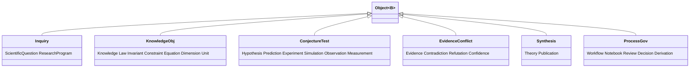

# 03 · Object Model

> [← System Architecture](./02-system-architecture.md) · [Knowledge Engine →](./04-knowledge-engine.md)

The object model is the kernel's core data structure — the "process image" of the
scientific OS. It **extends** the SDE RFC's `Object<B>` envelope
([SDE 03](../sde/03-object-model.md)); the hashing, canonical-serialization, and
determinism mechanics are specified there and inherited verbatim. This chapter
adds what SOS scope requires: the full metadata envelope from the mandate, the
enlarged object catalog, and how knowledge-bearing objects relate.

Rust is illustrative sketch.

---

## 1. The universal envelope

Every object in SOS-IR shares one immutable envelope. The mandate enumerates the
metadata each object must carry; here it is, itemized as fields.

```rust
pub struct Object<B> {
    // ---- identity ----
    pub id: ObjectId,          // content hash (BLAKE3, domain-separated) — the UUID
    pub urn: Urn,              // stable human alias, e.g. sos:law/kepler-3  (resolves to id)
    pub kind: Kind,            // (name, schema_version)  — semantic version of the SHAPE
    pub version: SemVer,       // semantic version of this OBJECT's content lineage
    // ---- time ----
    pub logical: LamportClock, // authoritative happens-before (hashed)
    pub wall: WallClock,       // advisory only, side-car, NOT hashed  (see SDE 03 §5)
    // ---- provenance ----
    pub parents: Vec<ObjectId>,// direct derivation edges (Merkle over lineage)
    pub producer: ProducerRef, // engine/plugin name + semver + content hash
    pub author: Author,        // human / agent / engine principal that initiated it
    // ---- reproducibility (the mandate's full traceability list) ----
    pub repro: ReproMeta,      // toolchain, compiler, hardware, solver & dataset versions,
                               // seed, rng algo, env digest, determinism level
    pub level: DeterminismLevel, // L0..L3 realized for THIS object (min over ancestors)
    // ---- integrity ----
    pub signature: Option<Signature>, // Merkle/Lamport attestation (scirust-provenance)
    // ---- payload ----
    pub body: B,               // the kind-specific content (catalog below)
}

pub struct ReproMeta {
    pub seed: u64,                    // mandatory (bench-schema rule)
    pub rng_algo: RngId,
    pub toolchain: ToolchainInfo,     // rustc channel + version (MSRV-pinned)
    pub compiler: CompilerDigest,     // exact compiler build
    pub hardware: HardwareClass,      // ISA, CPU/GPU model, BLAS impl, threads
    pub solvers: Vec<BackendVersion>, // SciRust crate ids + semver + content hash
    pub datasets: Vec<BlobRef>,       // content-addressed dataset versions
    pub env_digest: Hash,             // hash of all the above → the reproducibility key
}
```

Every field the mandate lists — content hash, logical timestamp, UUID, semantic
version, provenance links, reproducibility metadata, author, toolchain, compiler,
hardware, solver versions, dataset versions, seed, determinism level, digital
signature — has a home above. Two design choices carried from the SDE RFC:

- **The UUID is a content hash, not a random id** — identity *and* integrity for
  free; identical reasoning yields identical ids on any machine ([SDE 03 §1](../sde/03-object-model.md#1-everything-is-a-scientific-object)).
- **Two versions, deliberately.** `kind.schema_version` versions the object's
  *shape* (a breaking change to `Law`'s fields); `version` versions its *content
  lineage* (revision 3 of a particular law). They move independently.

---

## 2. The object catalog, by family

The mandate's object list, organized into the six families that map onto the
pipeline and the knowledge graph. Each is an `Object<B>` with the body sketched.



### Family I — Inquiry (what is being asked)
| Object | Body (illustrative) |
|---|---|
| **ScientificQuestion** | prose statement, domain tag, variables of interest, admissible hypothesis-space descriptor, success/stopping criterion. Root of a study. |
| **ResearchProgram** | a named, long-lived line of inquiry grouping many questions/theories over time (a Lakatosian program): hard core, protective belt, open frontier. The unit the Curiosity Engine grows. |

### Family II — Knowledge (what is believed to hold)
These are the nodes of the knowledge graph ([04](./04-knowledge-engine.md)). Many
carry **executable behavior**, not just text.
| Object | Body |
|---|---|
| **Knowledge** | the umbrella node type; a typed claim with citations and a domain of validity. |
| **Law** | a relationship asserted to hold in a domain (e.g. `F = m·a`) — an `Equation` + scope + evidence. |
| **Invariant** | a quantity/relationship conserved under a class of transformations; checkable. |
| **Constraint** | a restriction on admissible states/parameters; propagatable by the Reasoning Engine. |
| **Equation** | a symbolic relation (`scirust_symbolic::Expr` / `scirust_modalg` exact form) — *executable*: evaluable, differentiable, solvable. |
| **Dimension** | an SI dimensional signature (`scirust_units::Dimension`). Both a first-class node and an embedded value type. |
| **Unit** | a concrete unit of measure with its `Dimension`; used to type every `Measurement`. |

### Family III — Conjecture & test (how belief is challenged)
| Object | Body |
|---|---|
| **Hypothesis** | a candidate `Model` + prior weight + assumptions ([SDE 03 §3](../sde/03-object-model.md#3-models-and-how-a-domain-stays-generic)). |
| **Prediction** | what a hypothesis says an experiment will show, *with uncertainty*, conditioned on a design. |
| **Experiment** | a concrete, costed, **pre-registered** plan (design + analysis plan hashed before execution). |
| **Simulation** | an *in-silico* experiment: a backend-independent computational run ([08 §5](./08-workflow-and-simulation.md#5-the-simulation-engine)). A `Simulation` is an `Experiment` whose executor is a solver. |
| **Observation** | raw output of executing an experiment/simulation; recorded (L0 for physical, L2/L3 for sim). |
| **Measurement** | a single quantified datum inside an observation: `value × Unit ± uncertainty`. An `Observation` contains many `Measurement`s. |

### Family IV — Evidence & conflict (what the data forces)
| Object | Body |
|---|---|
| **Evidence** | an observation reduced to a hypothesis-relevant quantity (features/residuals) + which hypotheses it bears on. |
| **Contradiction** | a recorded incompatibility — two accepted claims that cannot both hold (structural via `units`, symbolic via `prove_equal`, logical via `neuro-symbolic`). |
| **Refutation** | evidence that excludes a hypothesis/claim (its posterior mass collapsed, or a prediction falsified). Recorded, never deleted. |
| **Confidence** | a belief state: posterior over hypotheses, likelihood used, entropy, pairwise discriminations ([SDE 05 §1](../sde/05-information-theory.md#1-the-bayesian-core)). |

### Family V — Synthesis (what we now hold to be true)
| Object | Body |
|---|---|
| **Theory** | first-class, *evolving*: axioms, assumptions, equations, domain of validity, supporting & contradicting evidence, confidence, citations, revision history, competing theories ([07 §3](./07-discovery-experiment-theory.md#3-the-theory-engine)). |
| **Publication** | a signed, citable snapshot of a sub-DAG; every figure re-executes from its node ([10 §5](./10-plugins-backends-interfaces.md#5-the-publication-engine)). |

### Family VI — Process & governance (how the OS itself acted)
| Object | Body |
|---|---|
| **Workflow** | an immutable DAG of engine invocations ([08](./08-workflow-and-simulation.md)). |
| **Notebook** | a human-readable, *reproducible* narrative view over a sub-DAG — the anti-notebook: immutable and re-runnable, not mutable scratch. |
| **Review** | an evaluation of a theory/publication/decision (human or engine), with rationale — first-class so peer review is provenance, not email. |
| **Decision** | a recorded choice (which experiment, which theory to publish) with the objects that justified it — the audit trail of judgement. |
| **Derivation** | the **explanation** object every Reasoning Engine conclusion emits: a proof/derivation trace citing the nodes and rules used ([05 §4](./05-reasoning-engine.md#4-every-conclusion-carries-a-derivation)). |

---

## 3. Serialization, hashing, versioning

Mechanics are inherited from the SDE RFC; SOS changes nothing normative:

- **Canonical serialization** — deterministic, fixed field order, canonical
  numbers, sorted maps ([SDE 03 §4](../sde/03-object-model.md#4-identity-hashing-and-canonical-serialization)).
  The only normative form; the JSONL interchange form mirrors
  `scirust-bench-schema`.
- **Hashing** — `id = BLAKE3(domain_tag ‖ canonical(obj))`; because `parents` are
  in the body, ids are a **Merkle hash over full lineage**, so tampering is
  detectable end-to-end. L3 payloads hash exactly; L2 payloads hash their
  *quantized* canonical form + carry a certificate; L0 payloads hash the
  recording ([09 §3](./09-provenance-reproducibility-storage.md#3-hashing)).
- **Signatures** — optional Merkle/Lamport attestation via `scirust-provenance`
  (`sign_artifact`/`verify_artifact`), for objects that must be attributable
  (`Publication`, `Decision`, `Review`).
- **Versioning** — `Kind = (name, schema_version)` in every hash; old objects
  never rewrite; schema bumps are SOS-RFC-gated with a `Migration` object
  recording the re-encoding.

---

## 4. Two clarifying distinctions

- **`Dimension`/`Unit` are both objects and value types.** As objects they are
  knowledge-graph nodes (the definition of the metre); as value types they are
  embedded in every `Measurement` and `Prediction` so the Reasoning Engine can
  dimension-check without a graph lookup. `scirust-units` supplies both roles.
- **`Simulation` ⊂ `Experiment`.** A simulation is an experiment whose executor is
  a solver rather than an instrument; it inherits pre-registration, cost, and
  provenance. This keeps the Discovery loop uniform whether evidence comes from a
  wet lab or a PDE solve — the only difference is the executor's determinism level
  ([08 §5](./08-workflow-and-simulation.md#5-the-simulation-engine)).

---

## Appendix · Object catalog quick reference

| Family | Objects | Typical determinism |
|---|---|---|
| Inquiry | ScientificQuestion, ResearchProgram | L3 |
| Knowledge | Knowledge, Law, Invariant, Constraint, Equation, Dimension, Unit | L3 (symbolic/exact) |
| Conjecture & test | Hypothesis, Prediction, Experiment, Simulation, Observation, Measurement | L0–L3 |
| Evidence & conflict | Evidence, Contradiction, Refutation, Confidence | L1–L3 |
| Synthesis | Theory, Publication | L3 |
| Process & governance | Workflow, Notebook, Review, Decision, Derivation | L3 |

All share the envelope of §1.

---

> [← System Architecture](./02-system-architecture.md) · [Knowledge Engine →](./04-knowledge-engine.md)
