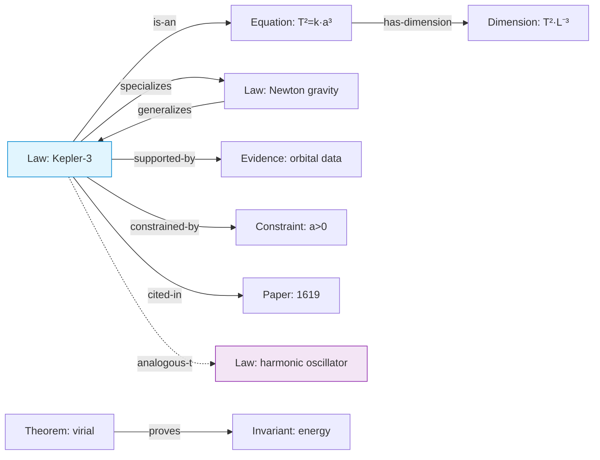

# 04 · Knowledge Engine

> [← Object Model](./03-object-model.md) · [Reasoning Engine →](./05-reasoning-engine.md)

The Knowledge Engine (`sos-knowledge`) is SOS's registry and long-term store of
*what is believed to hold* — a **real semantic knowledge graph**, not
documentation. Its nodes are typed, executable, queryable, provenance-bound
objects; its edges are typed semantic relations. It is backed by
`scirust-neuro-symbolic` (which already ships a `KnowledgeGraph` /
`Triple` / `Entity` / `Relation` model and a `KnowledgeBase` with `add_fact` /
`query`) and `scirust-graph` (traversal, isomorphism, motifs, centrality,
community detection).

Rust is illustrative sketch.

---

## 1. What makes it knowledge, not documentation

A wiki stores prose a human must read. The Knowledge Engine stores structure a
machine can *reason over*. Four properties draw the line:

| Property | Documentation | SOS Knowledge Engine |
|---|---|---|
| **Typed** | free text | every node is a Knowledge-family object ([03 §2](./03-object-model.md#family-ii--knowledge-what-is-believed-to-hold)) with a schema |
| **Executable** | inert | an `Equation` node evaluates/differentiates/solves; a `Constraint` propagates; an `Algorithm` runs as a workflow |
| **Queryable** | full-text search | Datalog pattern queries + graph-structural queries + semantic retrieval |
| **Provenance-bound & evolving** | edit history at best | append-only, versioned, confidence-weighted, never loses lineage |

---

## 2. The graph: nodes and edges

**Nodes** are Knowledge-family objects (plus papers, datasets, algorithms,
theorems, proofs, physical quantities). Each node is an immutable
`Object<B>` — content-addressed, versioned, provenance-bound.

**Edges** are typed, directed, first-class relations (`neuro-symbolic::Relation`
over `Entity` endpoints), themselves recorded with provenance:



Core edge vocabulary (extensible per domain): `is-a`, `generalizes` /
`specializes`, `derives-from`, `implies`, `equivalent-to`, `contradicts`,
`supported-by` / `refuted-by`, `constrained-by`, `has-dimension`, `measures`,
`cites`, `instance-of`, `supersedes`, and the discovery-critical
**`analogous-to`** (structural similarity across domains — see
[06 Curiosity](./06-curiosity-engine.md)).

```rust
pub trait Knowledge {                       // a "syscall" from sos-core
    fn assert(&self, nodes: &[Node], edges: &[Edge]) -> Result<Vec<ObjectId>, Err>;
    fn query(&self, q: &KnowledgeQuery) -> KnowledgeView;   // deterministic
    fn neighbors(&self, id: ObjectId, rel: Option<Relation>) -> Vec<ObjectId>;
}
```

---

## 3. Executable knowledge

The defining feature. A node does not merely *describe* a law; it *is* a runnable
handle to it.

- **`Equation`** wraps a `scirust_symbolic::Expr` (or a `scirust_modalg` exact
  form): `eval`, `diff`, `simplify`, `solve_linear`/`solve_quadratic`, `to_rust_code`.
  A `Prediction` is generated by *executing* the equation node the hypothesis
  cites.
- **`Constraint`** is a propagatable predicate: the Reasoning Engine's constraint
  propagation ([05 §2](./05-reasoning-engine.md#2-the-deterministic-toolbox))
  reads it directly.
- **`Invariant`** is a checkable conserved quantity: given a state transition, the
  engine verifies the invariant holds (and records a `Contradiction` if not).
- **`Algorithm`** wraps a `Workflow` id — running the algorithm node executes a
  reproducible, memoized workflow.
- **`Dimension`/`Unit`** are live `scirust_units` values — dimensional checking is
  a node method, not a lookup.

Because nodes are executable *and* immutable *and* content-addressed, "run the
law" is reproducible and cached: identical inputs to an equation node return the
memoized result ([08 §2](./08-workflow-and-simulation.md#2-content-addressed-memoization)).

---

## 4. Querying knowledge (three deterministic modes + one proposer)

The Knowledge Engine answers questions three deterministic ways, plus one
cognitive (untrusted) way kept strictly subordinate:

| Mode | Mechanism | Backend | Trust |
|---|---|---|---|
| **Pattern / logical** | Datalog facts + rules: "all laws implying energy conservation" | `neuro-symbolic::{KnowledgeBase, DatalogEngine, Atom, Term}` | deterministic (L3) |
| **Structural** | graph algorithms: shortest derivation path, betweenness, communities, `find_motifs`, `subgraph_isomorphism` | `scirust-graph` | deterministic (L3) |
| **Constraint** | propagate constraints to find admissible/forbidden regions | `neuro-symbolic::CspSolver` | deterministic (L3) |
| **Semantic (fuzzy)** | embedding retrieval: "nodes *like* this one" | `sos-ccos` / `scirust-retrieval` | **proposer only** — results are candidates the deterministic modes must confirm ([Invariant IX](./01-vision-and-principles.md#ix-propose-with-cognition-verify-with-deterministic-reasoning)) |

The semantic mode is powerful (it finds analogies humans miss) but its outputs
are **never authoritative** — they are leads the Reasoning Engine validates. A
retrieved "these two laws look similar" becomes knowledge only after
`prove_equal` / dimensional / structural confirmation.

```rust
pub enum KnowledgeQuery {
    Pattern(DatalogGoal),          // neuro-symbolic KnowledgeBase::query
    Path { from: ObjectId, to: ObjectId, rel: Option<Relation> },
    Motif(MotifSpec),              // scirust-graph::find_motifs
    Constrained(ConstraintSet),    // neuro-symbolic CSP
    Similar { seed: ObjectId, k: usize },   // COGNITIVE — proposer, untrusted
}
```

---

## 5. How knowledge evolves (append-only, never lost)

Knowledge changes; provenance must not. Evolution is expressed as *new objects
and edges*, never mutation:

- **Refinement** — a better `Law` is a new node with a `supersedes` edge to the
  old one. The old node remains valid, queryable, and pinned to the evidence that
  once supported it. "What did we believe in 2027?" is a query against the graph
  as-of a logical timestamp.
- **Confidence, not deletion** — a weakened claim's `Confidence` drops; a
  falsified one gets a `refuted-by` edge and a `Refutation` node. Nothing is
  removed — the anti-file-drawer property.
- **Contradiction is data** — when two accepted nodes conflict, the engine
  records a `Contradiction` linking both rather than silently dropping one; a
  `Decision`/`Review` later resolves it, itself recorded.
- **Domains of validity narrow explicitly** — Newtonian mechanics is not deleted
  when relativity arrives; its `Law` nodes gain a tightened `domain-of-validity`
  in a new revision, with an `analogous-to`/`limit-of` edge to the successor.

This is the knowledge-graph analogue of the OS filesystem being append-only and
content-addressed: you never overwrite a block, you write a new one and re-point.

---

## 6. Bootstrapping and dogfooding

The graph is seeded, not empty:

- **Units & dimensions** come free from `scirust-units` (the 7 SI base dimensions
  and derived units are the first knowledge nodes).
- **Equations & exact algebra** from `scirust-symbolic` / `scirust-modalg`
  (polynomial, modular, finite-field structures as executable nodes).
- **This repository's own knowledge** — the `docs/kb/` findings and
  `docs/research/` programs (CANR, ANEE, SRCC) are the first `ResearchProgram`
  and `Knowledge` nodes, making SOS's initial knowledge graph a faithful,
  queryable model of SciRust's actual research history.

---

> [← Object Model](./03-object-model.md) · [Reasoning Engine →](./05-reasoning-engine.md)
