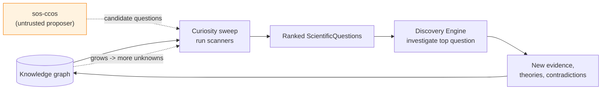

# 06 · Curiosity Engine

> [← Reasoning Engine](./05-reasoning-engine.md) · [Discovery, Experiment & Theory →](./07-discovery-experiment-theory.md)

The Curiosity Engine (`sos-curiosity`) is the **init / idle daemon** of the
scientific OS: the always-running process whose job is to *generate scientific
questions* by finding unknowns in the knowledge graph. Where every other engine
answers questions, this one **asks** them. It is what makes SOS a discovery
system rather than a calculator.

Rust is illustrative sketch.

---

## 1. Curiosity as the OS idle loop

An operating system's idle loop is not idleness — it is where the scheduler looks
for work to do. The Curiosity Engine plays exactly that role: when no study is
running, it scans the knowledge graph for research opportunities and emits ranked
`ScientificQuestion` objects that the Workflow Engine can schedule into the
Discovery Engine. A "curiosity sweep" is a reproducible workflow (seeded,
memoized), so the questions SOS asks are themselves auditable and re-derivable.

```rust
pub trait BeCurious {                    // a "syscall" from sos-core
    fn sweep(&self, kb: &KnowledgeView, budget: &Budget) -> Vec<ScoredQuestion>;
}
pub struct ScoredQuestion {
    pub question: ScientificQuestion,
    pub strategy: StrategyTag,           // which lens found it
    pub score: Priority,                 // info-gain · novelty · severity · 1/cost
    pub derivation: Derivation,          // WHY this is worth asking — always present
}
```

Like every SOS conclusion, a generated question carries a **derivation**: not
"the model felt this was interesting," but "hypothesis H has the weakest
`Confidence` in program P and its key parameter is unconstrained by any
experiment" — a checkable claim.

---

## 2. The strategies — deterministic scanners over the graph

The mandate's example questions become a set of deterministic **scanners**, each
a lens on the knowledge graph that yields candidate questions. All are backed by
existing capabilities.

| Strategy | The question it raises | Backing API |
|---|---|---|
| **Least-supported** | "Which hypothesis is least supported?" | scan `Confidence` objects for minimum posterior mass; graph in-degree of `supported-by` edges |
| **Unexplored parameters** | "Which equation has parameters no experiment has varied?" | `Equation` node `parameters()` (`scirust-symbolic`/`ParamSpace`) vs. experiment-coverage edges |
| **Maximal information gain** | "Which experiment would most reduce uncertainty?" | `sos-planner` EIG/BOED ([SDE 05](../sde/05-information-theory.md)) |
| **Contradiction hunt** | "Where are the contradictions?" | unresolved `Contradiction` objects from the Reasoning Engine ([05 §3](./05-reasoning-engine.md#3-contradiction-detection-four-levels-cheapest-first)) |
| **Cross-domain analogy** | "Which domains are disconnected but mathematically similar?" | `scirust-graph::{subgraph_isomorphism, graph_isomorphism, find_motifs}` (see §3) |
| **Under-connected knowledge** | "Which important nodes are weakly linked; which sub-fields are isolated?" | `scirust-graph::{betweenness_centrality, connected_components, modularity}` |
| **Frontier expansion** | "What does this new theory now make askable?" | `Theory` `raises` edges + `ResearchProgram` open frontier |

Each scanner is pure and deterministic; a sweep runs them under a budget and
merges their outputs.

---

## 3. Cross-domain analogy detection (the standout capability)

The most distinctive question SOS can ask — *"which disconnected domains share a
mathematical structure?"* — is precisely a **graph-isomorphism / motif-mining**
problem, and `scirust-graph` already provides the primitives:

- Compute structural signatures of subgraphs in different `ResearchProgram`s
  (equation/constraint/relation topology).
- `subgraph_isomorphism` / `find_motifs` surface pairs of **structurally
  identical but semantically disconnected** regions — e.g. a damped-oscillator
  subgraph in physics matching a mean-reverting-process subgraph in finance.
- Each match becomes a candidate `analogous-to` edge and a `ScientificQuestion`:
  "does the mapping that makes these isomorphic transfer law L from domain A to
  domain B?"

Crucially, the analogy is only a **proposal**: the Reasoning Engine must then
verify it dimensionally and symbolically ([05 §6](./05-reasoning-engine.md#6-the-reasoning-engine-as-verifier-invariant-ix-in-practice))
before any transferred law is trusted. Curiosity finds the resemblance;
reasoning decides whether it is real. This is where SOS could genuinely surface
cross-disciplinary connections a specialist would never see — the
[F7 cross-domain-transfer research direction](../sde/10-roadmap-risks-future.md#f7--cross-domain-prior-transfer)
of the SDE RFC, now with a concrete detector.

---

## 4. Scoring, prioritization, and the cognitive proposer

A sweep can generate many questions; the engine ranks them so the OS spends
effort where it matters.

- **Priority** combines expected information gain (`sos-planner`), novelty
  (graph distance from existing well-studied nodes), contradiction severity, and
  inverse cost. The weighting is an explicit, versioned policy object — no opaque
  scoring (Invariant VI).
- **The cognitive backend adds proposals, subordinately.** CCOS /
  `scirust-sciagent` may suggest questions from semantic memory ("papers on X
  hint at an untested link to Y"). These enter as **untrusted, attested**
  candidates: they are scored by the *same deterministic* priority function and
  must reference real graph nodes; a proposal that cites nothing in the graph is
  discarded. Cognition broadens the question space; the deterministic scorer and
  the Reasoning Engine keep it grounded.

```rust
pub struct CuriosityPolicy {              // explicit, versioned — a knowledge object
    pub w_info_gain: f64, pub w_novelty: f64,
    pub w_contradiction: f64, pub w_inv_cost: f64,
    pub allow_cognitive_proposals: bool,  // default true; proposals still scored deterministically
}
```

---

## 5. The perpetual loop



The loop never terminates by design: answering a question grows the graph, which
exposes new unknowns, which generate new questions. This is the "continuously
searches for research opportunities" mandate — realized as the OS's idle-loop that
always has work when the researcher (or the scheduler) wants it. A stopping
*budget* bounds any single sweep; the loop itself is perpetual.

---

## 6. Why deterministic curiosity matters

It would be easy to make an LLM "brainstorm questions." SOS deliberately does not
rely on that, because a research agenda that cannot be reproduced or defended is
the reproducibility crisis moved upstream. A deterministic Curiosity Engine gives
three things an LLM brainstorm cannot:

1. **Reproducibility** — the same graph yields the same ranked questions; a
   sweep is a citable workflow.
2. **Defensibility** — every question comes with a derivation grounded in real
   graph structure, not a hunch.
3. **Auditability of the agenda** — you can inspect *why* SOS is investigating
   what it is, and correct the policy if the priorities are wrong.

The cognitive backend still contributes — as a proposer whose suggestions are
scored and grounded by the same deterministic machinery.

---

> [← Reasoning Engine](./05-reasoning-engine.md) · [Discovery, Experiment & Theory →](./07-discovery-experiment-theory.md)
