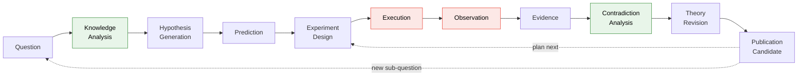
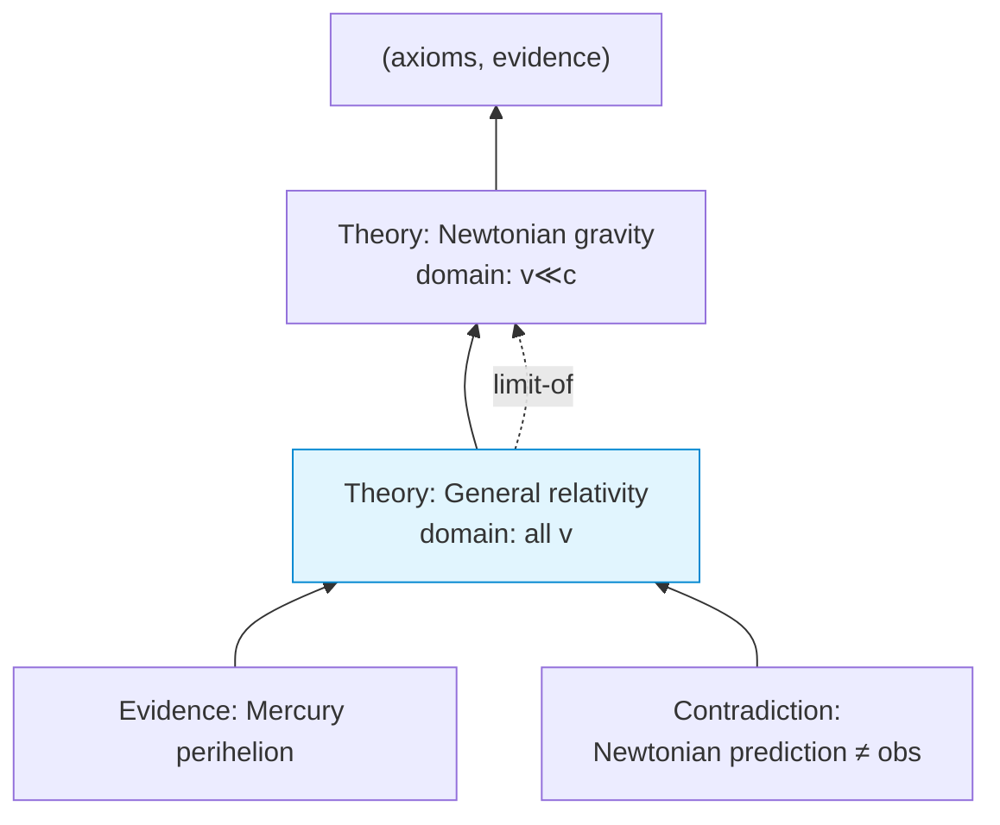
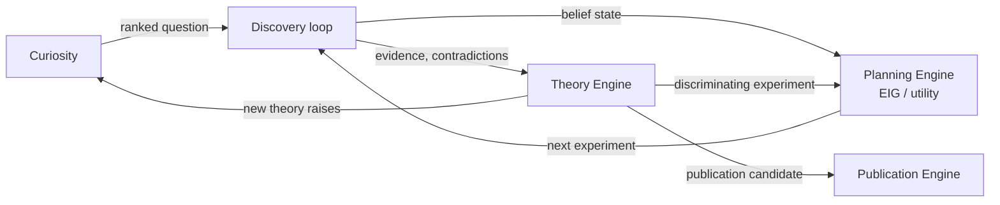

# 07 · Discovery, Experiment & Theory

> [← Curiosity Engine](./06-curiosity-engine.md) · [Workflow & Simulation →](./08-workflow-and-simulation.md)

This chapter covers the three engines that turn a question into a validated,
evolving theory: the **Discovery Engine** (the SDE loop, re-homed under SOS), the
**Experiment/Planning Engine** (Bayesian optimal experiment design), and the
**Theory Engine** (theories as first-class evolving objects). The Discovery and
Planning mechanics are specified in [RFC-0001](../sde/README.md); this chapter
states what SOS *adds*.

Rust is illustrative sketch.

---

## 1. The Discovery Engine = SDE, with two new stages

The Discovery Engine is the [SDE subsystem](../sde/04-workflow-engine.md). SOS's
richer knowledge and reasoning layers add **two stages** to the SDE pipeline —
`Knowledge Analysis` up front and `Contradiction Analysis` before revision — and
a `Publication Candidate` terminal:



Every stage is a plugin ([SDE 04 §1](../sde/04-workflow-engine.md#1-a-stage-is-a-pure-pass-over-the-graph));
every stage is independently replaceable. The two additions:

- **Knowledge Analysis (new).** Before generating hypotheses, query the Knowledge
  Engine for the laws, constraints, invariants, and prior evidence relevant to
  the question. Hypotheses are then generated *constrained by existing knowledge*
  (a candidate that violates a known invariant or a dimensional constraint is
  rejected at birth by the Reasoning Engine), rather than in a vacuum. This is
  what a scientist does first and what a bare SDE loop lacked.
- **Contradiction Analysis (new).** Before revising a theory, run the Reasoning
  Engine's four-level contradiction detection ([05 §3](./05-reasoning-engine.md#3-contradiction-detection-four-levels-cheapest-first))
  across the new evidence and the standing theory set, emitting explicit
  `Contradiction`/`Refutation` objects that drive the revision.

The remaining stages, the memoized DAG execution, the record/replay effect
boundary, and the information-exhaustion stopping rules are all as in the SDE RFC.

---

## 2. The Experiment / Planning Engine

The Planning Engine (`sos-planner`) is the SDE information-theory subsystem
([SDE 05](../sde/05-information-theory.md)), reused unchanged and shared with the
Curiosity Engine. It implements the mandate's four requirements directly:

| Mandate requirement | Realized as |
|---|---|
| **Bayesian optimal experiment design** | maximize `EIG(ξ) = I(Θ; D \| ξ)` over candidate designs ([SDE 05 §2](../sde/05-information-theory.md#2-information-gain-the-core-quantity)) |
| **Expected Information Gain** | closed-form for GP surrogates (`scirust-gp` predictive variance), nested-MC / variational otherwise; every estimate carries its own error bar |
| **Experiment utility estimation** | `U(ξ) = EIG(ξ)/cost(ξ)`, a pluggable `UtilityPolicy` |
| **Cost estimation** | the `Experiment` cost model (compute, time, samples, risk) |
| **Automatic prioritization** | rank candidate experiments by utility; recommend `ξ*` or signal information exhaustion |

Nothing here is re-implemented for SOS; the Planning Engine is the same crate the
Curiosity Engine calls to score "which experiment would most reduce uncertainty."
That reuse is the point — one information-theoretic core serves both "what should
we ask?" (curiosity) and "what should we run?" (planning).

---

## 3. The Theory Engine

Theories are **first-class, immutable, evolving** objects — not a status flag on a
hypothesis. This is the substantial engine SOS adds beyond SDE.

### Anatomy of a `Theory`

```rust
pub struct Theory {                       // the body of an Object<Theory>
    pub axioms: Vec<ObjectId>,            // Knowledge nodes taken as given
    pub assumptions: Vec<ObjectId>,       // explicit, defeasible premises
    pub equations: Vec<ObjectId>,         // Law/Equation nodes it asserts
    pub domain_of_validity: Scope,        // where it claims to hold (and where not)
    pub supporting: Vec<ObjectId>,        // Evidence for
    pub contradicting: Vec<ObjectId>,     // Evidence against — KEPT, never hidden
    pub confidence: ObjectId,             // a Confidence object (posterior/Bayes factors)
    pub citations: Vec<ObjectId>,         // papers/prior theories
    pub revises: Option<ObjectId>,        // parent theory this one supersedes
    pub competitors: Vec<ObjectId>,       // rival theories over the same phenomenon
}
```

Every field the mandate lists — axioms, assumptions, equations, domain of
validity, supporting evidence, contradicting evidence, confidence, citations,
revision history, competing theories — is present, and each is an `ObjectId` into
the graph, so a theory is a *view over provenance*, not a document.

### Theories evolve; provenance does not



- A **revision** is a *new* `Theory` node citing its parent (`revises`) and the
  `Evidence`/`Contradiction` that forced it. The old theory is never deleted; its
  `domain_of_validity` may be narrowed in the successor (Newtonian mechanics
  becomes the low-velocity *limit* of relativity, with a `limit-of` edge), and it
  remains a valid, queryable node.
- **Competing theories coexist.** The Theory Engine does not force a single
  winner; it maintains the competition, ranking rivals by their `Confidence`
  (Bayes factors, [SDE 05 §1](../sde/05-information-theory.md#1-the-bayesian-core))
  *restricted to their overlapping domain of validity*. Which experiment would
  best discriminate two rivals is exactly an EIG query to the Planning Engine —
  closing the loop back to experiment design.
- **Contradicting evidence is retained inside the theory.** A theory that ignores
  its anomalies is dishonest; SOS makes the anomalies a first-class field, so
  "what does this theory fail to explain?" is always answerable.

```rust
pub trait TheoryEngine {
    fn revise(&self, t: &Theory, forced_by: &[ObjectId]) -> Theory;       // new node
    fn compare(&self, rivals: &[ObjectId], on: &Scope) -> Ranking;        // over shared domain
    fn discriminating_experiment(&self, rivals: &[ObjectId]) -> Plan;     // -> Planning Engine
}
```

---

## 4. How the three engines interlock



The interlock is a closed loop: curiosity poses a question, discovery
investigates it, the planner directs its experiments, the theory engine
synthesizes the result and — because a new theory *raises* new questions — feeds
the curiosity engine again. A `Publication Candidate` is emitted whenever a
theory's confidence and evidential support cross a (configurable, explicit)
threshold, handing off to the [Publication Engine](./10-plugins-backends-interfaces.md#5-the-publication-engine).

---

## 5. What SOS adds over the bare SDE loop, summarized

| Capability | SDE (RFC-0001) | SOS (RFC-0002) |
|---|---|---|
| Hypotheses grounded in existing knowledge | — | **Knowledge Analysis** stage queries the graph first |
| Explicit contradiction handling | contradiction detection noted | **Contradiction Analysis** stage + first-class `Contradiction`/`Refutation` objects |
| Theories | `sde-theory` (revision) | full **Theory Engine**: competition, domains of validity, retained anomalies, discriminating-experiment planning |
| Question source | external / manual | the **Curiosity Engine** feeds questions automatically |

---

> [← Curiosity Engine](./06-curiosity-engine.md) · [Workflow & Simulation →](./08-workflow-and-simulation.md)
