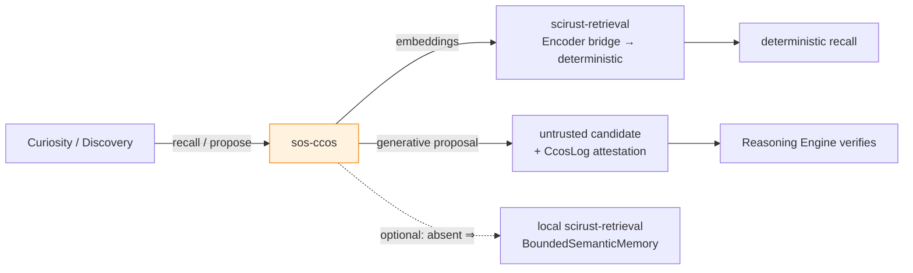

# 10 · Plugins, Backends & Interfaces

> [← Provenance, Reproducibility & Storage](./09-provenance-reproducibility-storage.md) · [Workspace & Crate Graph →](./11-workspace-and-crate-graph.md)

This chapter specifies the plugin interface (the "driver model"), the two
preferred backends — **SciRust** (computational) and **CCOS** (cognitive) — and
the userland interfaces: CLI, MCP server, and Publication Engine. The plugin and
SciRust mechanics are specified in [SDE 07](../sde/07-extension-api-and-plugins.md)
and [SDE 08](../sde/08-scirust-integration.md); this chapter states the SOS
additions, chiefly the **cognitive backend**.

Rust is illustrative sketch.

---

## 1. The plugin interface

Everything in SOS is extensible through one registry, three transports — the
device-driver model of the OS ([SDE 07 §4–5](../sde/07-extension-api-and-plugins.md#4-the-registry--capability-descriptors)):

| Transport | Trust / isolation | Determinism | Use |
|---|---|---|---|
| **Static Rust** | full trust, in-process, zero-cost | up to L3 | the default; `sos-scirust`, first-party engines |
| **WASM component** | sandboxed, no ambient authority | strong L3 box for untrusted code | community/third-party algorithms |
| **MCP / wire** | out-of-process, capability-scoped | as declared (often L0/L1) | non-Rust stacks (a NumPy analysis, a lab robot), remote services, `sos-ccos` |

Plugins register a `PluginDescriptor` (name, semver, **content hash**,
implemented syscall, declared determinism level, capability set, domains) and are
resolved by name + version — the resolved content hash is recorded in the
`RunLedger`, so a rerun that binds a different implementation is a *detected
drift*, not a silent substitution. Capability-gating (network, GPU, filesystem,
effectful) enforces least privilege, patterned on
`scirust-discovery::ScopeAuthorization`.

**Backend-independence is enforced, not intended:** `scirust-*` and CCOS appear
in exactly two crates (`sos-scirust`, `sos-ccos`); a CI dependency-lint fails the
build if any other SOS crate names them ([11 §5](./11-workspace-and-crate-graph.md#5-dependency-invariants-enforced-in-ci)).

---

## 2. The computational backend — `sos-scirust`

The default provider of numerics and algorithms, wrapping SciRust crates through
a uniform adapter (seed in, determinism level out). It implements the engine
syscalls that need computation — `Simulate`, the Discovery stages, the
statistical/GP/planning primitives — by calling `scirust-solvers`,
`scirust-stats`, `scirust-gp`, `scirust-symreg`, `scirust-signal`,
`scirust-automl`, `scirust-gpu`, `scirust-units`, `scirust-retrieval`, and the
reasoning crates. The complete stage→crate and domain→crate maps are
[SDE 08 §2–4](../sde/08-scirust-integration.md#2-stage--crate-map-with-exact-api-surfaces).
SOS never duplicates a SciRust capability; it wraps it (Invariant VIII).

---

## 3. The cognitive backend — `sos-ccos`

This is the new backend at SOS scope, and the counterpart to the computational
one. **CCOS ("Causal-Context OS")** is a sibling system: a bounded-memory, paged
**causal graph** with a **hash-chained, tamper-evident event log**. Its structure
mirrors SOS's own append-only-DAG-plus-provenance, which is exactly why it slots
in cleanly as long-term scientific memory.

`sos-ccos` wraps CCOS in four roles — and only the last three are trusted:

```rust
pub trait Remember {                      // the cognitive "syscall"
    fn store(&self, o: &Object<Bytes>);                    // persist to scientific memory
    fn recall(&self, q: &Recall, k: usize) -> Vec<ObjectId>;  // semantic retrieval (proposer)
    fn attest(&self, input: &[u8], output: &[u8]) -> CcosChainRef;  // hash-chained record
    fn context(&self, focus: ObjectId, budget: TokenBudget) -> ContextPage;  // paged memory
}
```

| Role | What CCOS provides | How SOS uses it | Trust |
|---|---|---|---|
| **Propose** (questions/hypotheses/analogies) | LLM-backed generation from semantic memory | Curiosity/Discovery candidates — **untrusted**, must survive deterministic verification | proposer only (Invariant IX) |
| **Scientific memory** | paged causal graph, persistence | long-term store of knowledge nodes beyond the working set | trusted (persistence, not judgement) |
| **Semantic retrieval** | embeddings | bridged into `scirust-retrieval`'s `Encoder` trait → a **deterministic** `SemanticRetriever` (per `docs/CCOS_INTEGRATION_PROMPT`), so retrieval is replay-exact and auditable rather than generative RAG | trusted (deterministic bridge) |
| **Attestation** | `CcosLog` hash-chain (`input_hash→output_hash→chain_hash`, `verify()`) | anchored into SOS provenance so every cognitive act is tamper-evidently recorded | trusted (integrity) |
| **Context management** | bounded-memory paging (the `elastic_kv_cache` / conformal `guard` pattern) | keep reasoning within a bounded, reproducible context window | trusted (mechanism) |

The crucial design move (from the CCOS integration pattern already in this repo):
**do not consume CCOS's generative RAG as truth.** Bridge its *embeddings* into
`scirust-retrieval`'s deterministic dense retriever, so "recall similar prior
work" is bit-for-bit reproducible and produces *candidates*, while the generative
side is confined to the proposer role. Cognition supplies leads and memory;
determinism supplies verdicts.

**Backend-independence:** `sos-ccos` is optional. Without it, `Remember` falls
back to a local `scirust-retrieval` `BoundedSemanticMemory` over the object store
— SOS loses long-term cognitive memory and LLM proposals but remains fully
functional and fully deterministic. The kernel never depends on CCOS.



---

## 4. Userland interfaces — CLI and MCP

### `sos-cli` — the git-style shell
The `sos` binary is porcelain over the engine plumbing, deliberately Git-shaped so
the mental model transfers:

| Command | Does |
|---|---|
| `sos init` / `sos clone` / `sos push` | create / copy / share a reasoning repository (the object store) |
| `sos ask` | run a **curiosity sweep**; list ranked open questions |
| `sos run <manifest>` | execute a discovery workflow to completion or stopping rule |
| `sos plan` | show the planner's recommended next experiment + its EIG/cost |
| `sos know <query>` | query the knowledge graph (Datalog / structural / semantic) |
| `sos why <object>` | print the derivation/provenance that justifies an object |
| `sos verify <object>` | re-execute and check the reproducibility contract |
| `sos log` / `sos diff` / `sos merge` | history, compare two studies, reconcile two labs' graphs |
| `sos publish <theory>` | render a publication candidate |
| `sos plugins` | list / find plugins by syscall + domain + declared level |

### `sos-mcp` — tools for agents
Exposes SOS's syscalls as MCP tools (wrapping `scirust-mcp`), so `scirust-sciagent`
or any external agent can drive the OS — *as a proposer*. Every agent action is
attested and enters the graph as an untrusted object subject to deterministic
verification. `sos-mcp` also **consumes** MCP servers as plugins (a Python
analysis, a remote solver, a lab controller), which is how non-Rust backends
attach without violating the pure-Rust core.

---

## 5. The Publication Engine

`sos-publication` turns a validated sub-DAG into a citable artifact. The mandate's
outputs map to render targets over the same provenance graph:

- **Auto-generated content**: experiment report, methodology (reconstructed from
  the `Workflow`/`RunLedger`), a **reproducibility appendix** (the `env_digest`
  lockfile + `sos verify` transcript), tables, figures, citations (from the
  `cites` edges), supplementary material.
- **Formats**: publication-ready Markdown, LaTeX, HTML, PDF.
- **Executable paper**: every figure and table records the `ObjectId` it
  re-executes from, so `sos publish --verify` regenerates them from the graph and
  fails if any drifts. A reader can re-run any figure.
- **Signed root**: the `Publication` object fixes a sub-DAG root and is
  Merkle/Lamport-signed ([09 §6](./09-provenance-reproducibility-storage.md#6-the-provenance-engine--version-control-for-reasoning)),
  so a third party verifies the whole study's integrity from one 32-byte root.

```rust
pub trait Publish {
    fn render(&self, root: ObjectId, fmt: Format, opts: &PubOpts) -> Artifact;
    fn verify(&self, pubn: ObjectId) -> VerifyReport;   // re-execute every figure
}
```

This is the natural terminus of the whole system: a paper whose every claim,
figure, and number is a node you can trace, re-run, and check — the reproducibility
crisis inverted.

---

> [← Provenance, Reproducibility & Storage](./09-provenance-reproducibility-storage.md) · [Workspace & Crate Graph →](./11-workspace-and-crate-graph.md)
