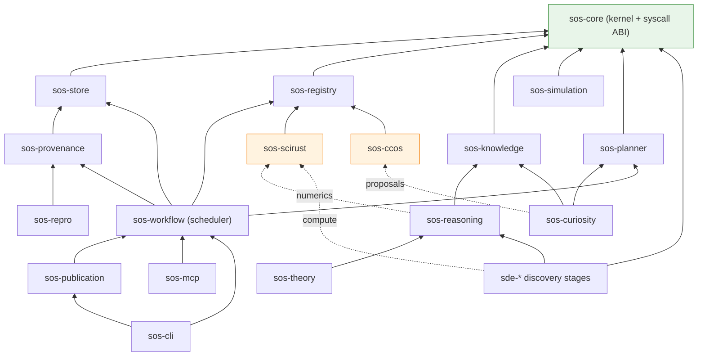

# 11 · Workspace & Crate Graph

> [← Plugins, Backends & Interfaces](./10-plugins-backends-interfaces.md) · [Engineering & Roadmap →](./12-engineering-and-roadmap.md)

The concrete deliverable: the `sos-*` workspace, how the SDE RFC's crates
re-home into it, the crate dependency graph, MSRV/toolchain, and the invariants
CI enforces.

---

## 1. Workspace shape

SOS is a **separate Cargo workspace** at `sos/` in this monorepo (sibling to the
SciRust crates and to `sde/`), so it dogfoods against SciRust via path
dependencies while remaining independently publishable. `scirust-*` and CCOS are
consumed by exactly two adapter crates.

```
sos/
├── Cargo.toml                    # [workspace] members below; resolver = "2"
│
├── sos-core/                     # KERNEL: objects, hashing, determinism, capabilities,
│                                 #   the engine syscall traits, Domain & Model traits, errors
├── sos-store/                    # Storage Layer (content-addressed object store)
├── sos-provenance/               # Provenance Engine (env capture, signing)
├── sos-repro/                    # Reproducibility Engine (hermetic pins, verify, rerun)
├── sos-registry/                 # Plugin System (registry, capabilities, static/WASM/MCP)
│
├── sos-knowledge/                # Knowledge Engine (semantic knowledge graph)
├── sos-reasoning/                # Reasoning Engine (deterministic, no LLM)
├── sos-curiosity/                # Curiosity Engine (question generation)
├── sos-theory/                   # Theory Engine (first-class evolving theories)
├── sos-simulation/               # Simulation Engine (backend-independent interface)
├── sos-planner/                  # Planning Engine (Bayesian OED / EIG)  [= SDE infotheory+planner]
├── sos-workflow/                 # Workflow Engine (the scheduler)
├── sos-publication/              # Publication Engine (reports · LaTeX · PDF · executable paper)
│
├── sde-question/                 # ┐
├── sde-hypothesis/               # │
├── sde-prediction/               # │  DISCOVERY ENGINE subsystem — the SDE stages,
├── sde-experiment/               # │  re-homed on sos-core (RFC-0001, re-based)
├── sde-observation/              # │
├── sde-evidence/                 # │
├── sde-statistics/               # │
├── sde-ranking/                  # ┘
│
├── sos-scirust/                  # COMPUTATIONAL backend adapter (the only scirust-* consumer)
├── sos-ccos/                     # COGNITIVE backend adapter (the only CCOS consumer)
│
├── sos-mcp/                      # MCP server (+ consumes MCP plugins)
└── sos-cli/                      # the `sos` binary (git-style porcelain)
```

Twenty-five crates: 5 kernel/substrate, 8 engines, 8 discovery stages, 2
backends, 2 userland. The granularity *is* the "every stage is independently
replaceable / backend-independent" requirement, expressed in Cargo.

---

## 2. How the SDE RFC re-homes into SOS

No SDE work is discarded; the SDE RFC-0001 crates promote, merge, or persist as
the Discovery subsystem — the append-only, RFC-gated evolution
[Invariant governance](./01-vision-and-principles.md#5-governance--the-rfc-process)
prescribes.

| SDE RFC-0001 crate | Disposition under SOS |
|---|---|
| `sde-core` | **promoted → `sos-core`** (the kernel; generalized envelope with author + signature) |
| `sde-store` | **promoted → `sos-store`** |
| `sde-provenance` | **promoted → `sos-provenance`** |
| `sde-registry` | **promoted → `sos-registry`** |
| `sde-workflow` | **promoted → `sos-workflow`** (now schedules all engines) |
| `sde-infotheory` + `sde-planner` | **merged → `sos-planner`** (Planning Engine) |
| `sde-theory` | **subsumed → `sos-theory`** (full Theory Engine) |
| `sde-scirust` | **promoted → `sos-scirust`** |
| `sde-mcp` | **promoted → `sos-mcp`** |
| `sde-cli` | **promoted → `sos-cli`** |
| `sde-report` | **promoted → `sos-publication`** |
| `sde-question … sde-ranking` (8) | **kept** as the Discovery Engine stages, re-based on `sos-core` |

New at SOS scope (no SDE precursor): `sos-repro`, `sos-knowledge`,
`sos-reasoning`, `sos-curiosity`, `sos-simulation`, `sos-ccos` — the additions
that make SOS an operating system rather than one discovery loop.

---

## 3. Crate dependency graph



`sos-core` is the universal sink (depends on nothing in SOS; everything depends
on it). The two backend adapters are depended-upon by *no one by name* — they are
reached only through `sos-registry` and the dotted capability edges — which is
precisely what makes them swappable.

---

## 4. MSRV & toolchain

- **Rust stable**, MSRV **1.89** (the workspace's existing MSRV; the repo's
  `Check (MSRV 1.89.0)` CI job gates it). No SOS crate uses a nightly feature —
  the pure-Rust, stable-buildable guarantee is a hard constraint (Invariant X).
- **`resolver = "2"`**, `edition = "2021"` (or 2024 where the kernel benefits, as
  `scirust-core` already does), matching workspace conventions.
- **Pinned build**: the workspace `rust-toolchain.toml` fixes the compiler for
  reproducible builds; the pin is captured into every object's `env_digest`
  ([09 §7](./09-provenance-reproducibility-storage.md#7-the-reproducibility-engine--the-package-manager-nix-analogy)).

---

## 5. Dependency invariants (enforced in CI)

Four rules keep the workspace acyclic and the OS guarantees real. Each is a
`cargo`-metadata lint that **fails the build** on violation — intent is not
enough at this scale. Enforced by `sos/scripts/lint-deps.py`, run as its own
job in `sos-ci.yml`.

1. **`sos-core` is the universal sink.** It depends on no other SOS crate; every
   other SOS crate depends on it, directly or transitively.
2. **No cyclic dependencies** anywhere (the mandate's explicit requirement),
   checked over normal + build dependencies. Dev-dependency back-edges (a
   crate's tests exercising a crate that depends on it) are exempt — that is a
   Cargo-supported pattern, not an architectural cycle.
3. **No engine depends on another engine by type**, except the documented
   composition edges (`reasoning → knowledge`, `curiosity → {knowledge,
   reasoning, planner}`, `theory → reasoning`, discovery stages `→ reasoning`).
   Engines otherwise compose only through `sos-core` traits and SOS-IR objects
   — the guarantee of independent replaceability.
4. **`scirust-*` and CCOS appear in exactly two crates** (`sos-scirust`,
   `sos-ccos`). Any other SOS crate naming them, in any dependency kind
   (including dev-dependencies — a test-only leak is still a coupling), fails
   the lint — the mechanical guarantee of backend-independence (Invariant
   VIII).

---

## 6. Relationship to the SciRust workspace

SOS neither modifies nor is included in the SciRust workspace build; it is a
downstream consumer. This keeps SciRust's "whole workspace builds on stable" gate
intact and lets SOS evolve on its own release cadence. The two adapter crates
(`sos-scirust`, `sos-ccos`) are the only coupling points, both behind the
registry, both optional — so SciRust can refactor internally without breaking SOS
as long as the wrapped public APIs hold, and SOS can add a non-SciRust backend
without touching the kernel.

---

> [← Plugins, Backends & Interfaces](./10-plugins-backends-interfaces.md) · [Engineering & Roadmap →](./12-engineering-and-roadmap.md)
