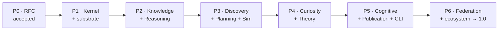

# 12 · Engineering & Roadmap

> [← Workspace & Crate Graph](./11-workspace-and-crate-graph.md) · [Back to README](./README.md)

This chapter fixes the engineering contract — coding standards, testing strategy,
the incremental development discipline — and the phased roadmap, risks, and
future research. It is where the mandate's "production-ready each phase, no
technical debt" becomes a concrete gate.

---

## Part A · Engineering

### 1. The development discipline

The mandate is explicit: **do not implement everything at once.** Every subsystem
follows the same five-step cycle, and nothing merges before step 5:

```
Design → Critique → Refactor → Validate → Implement
```

- **Design** — an RFC section (or amendment) fixing the crate's traits, objects,
  and invariants before code.
- **Critique** — an adversarial review pass: what breaks determinism, what
  couples two engines, what a plugin author will trip over.
- **Refactor** — fix the design, not the code (there is no code yet).
- **Validate** — property tests and oracles for the *design's* invariants, written
  against the trait surface.
- **Implement** — only now; and the result must clear the gate below in one merge.

Each phase ends in a **production-ready** state: documented, tested, deterministic,
`clippy -D warnings` clean. A subsystem that is not ready is not merged — it stays
on a branch. There is no "TODO, fix later"; the RFC forbids it (Invariant XI).

### 2. Coding standards — the gate

Every merge into a phase must pass all of these. They are the same standards the
SciRust workspace already enforces, lifted verbatim:

| Standard | Rule |
|---|---|
| Language | Rust **stable**, MSRV **1.89**, `resolver = "2"` |
| Format | `cargo fmt` clean |
| Lint | `cargo clippy --workspace --all-targets -- -D warnings` clean |
| Safety | **no `unsafe`** except where *mathematically justified*, documented, and property-tested; **no FFI** |
| Docs | **100 % documented public API** (`#![deny(missing_docs)]`); continuous documentation |
| Dependencies | **no cyclic deps**; the four [dependency invariants](./11-workspace-and-crate-graph.md#5-dependency-invariants-enforced-in-ci) |
| Completeness | **no TODO, no placeholder, no stub, no mock** presented as production |
| Determinism | determinism tests pass (same input ⇒ same hash, cross-run) |

### 3. Testing strategy

Testing is layered, and two layers are specific to SOS's guarantees:

| Layer | What it checks | Tooling |
|---|---|---|
| **Unit + oracle** | correctness against **hand-derived** values, never adjusted to match buggy output (the repo's stated discipline) | `#[test]`, `approx` |
| **Property-based** | invariants over generated inputs: canonical-serialization round-trips, hash stability, `put` idempotence, determinism-level monotonicity | `proptest`/`quickcheck`-style |
| **Determinism** | *the* SOS-defining test: identical (inputs, seed, env) ⇒ **byte-identical object ids** across runs and, at L3, across machines | custom harness + `sos verify` |
| **Reproducibility contract** | `sos verify <object>` re-executes a sub-DAG and confirms the [contract](./09-provenance-reproducibility-storage.md#8-the-reproducibility-contract-restated-for-sos) at every node's declared level | `sos-repro` |
| **Propose/verify** | a cognitive proposal that fails a deterministic check never becomes a trusted node (Invariant IX) | integration tests with a stub proposer |
| **Benchmark** | performance regressions gated; inputs pinned to a seeded generator | `criterion` + `scirust-bench-schema` records |
| **Fuzz** | untrusted parsers/deserializers (object wire format, plugin manifests, MCP) | `cargo-fuzz` (nightly, isolated job, as the repo already does) |
| **CI / CD** | all of the above on every PR; continuous documentation build | GitHub Actions (the repo's existing matrix) |

The **memoization-equivalence** property deserves a specific mention: a test must
assert `cache-hit result == recompute result` for every stage, because a wrong
cache silently corrupts conclusions — the worst failure mode for a reasoning OS
([SDE R9](../sde/10-roadmap-risks-future.md#r9--correctness-of-the-reasoning-kernel-itself)).

---

## Part B · Roadmap

Vertical-slice first: each phase is a thin, complete pass through the relevant
subsystems, ending production-ready. The first thing SOS reasons about is
SciRust's own research history (`docs/kb/`, `docs/research/`).



| Phase | Delivers | Production-ready proof |
|---|---|---|
| **P0 — RFC** | this document, accepted; frozen `sos-core` ABI + object schema v1 | design critique passed; every mandate section addressed |
| **P1 — Kernel & substrate** | `sos-core`, `sos-store`, `sos-provenance`, `sos-repro`, `sos-registry` | store & `sos verify` a `docs/kb/` run as a hashed, replayable DAG; determinism + contract test suites green on two machines |
| **P2 — Knowledge & Reasoning** | `sos-knowledge`, `sos-reasoning` | seed the graph from `scirust-units`/`symbolic`/`modalg` + `docs/kb`; every conclusion emits a `Derivation`; four-level contradiction detection works with `Proof`/`Check` labels |
| **P3 — Discovery, Planning, Simulation** | re-homed `sde-*` stages, `sos-planner`, `sos-simulation`, `sos-workflow` | close the loop on a synthetic law-discovery task; planner beats random/grid on experiments-to-`posterior_mass>0.99`; simulations memoize |
| **P4 — Curiosity & Theory** | `sos-curiosity`, `sos-theory` | a curiosity sweep surfaces a real cross-domain analogy in the seeded graph that the Reasoning Engine then verifies; theories revise with retained anomalies |
| **P5 — Cognitive, Publication, Userland** | `sos-ccos`, `sos-publication`, `sos-cli`, `sos-mcp` | propose/verify end-to-end (CCOS proposes, reasoning verifies, all attested); an executable paper regenerates every figure via `sos publish --verify` |
| **P6 — Federation & ecosystem → 1.0** | graph `merge`, WASM/MCP plugin GA, hardening | two labs' graphs merge with explicit conflict objects; a third-party WASM plugin and a non-Rust MCP backend run in a real study; `sos-core` ABI commits to semver stability |

**1.0** is declared only after P6's reproducibility contract holds across machines
and backends. Each phase is independently useful and shippable.

---

## Part C · Risks & mitigations

Beyond the [SDE risk register](../sde/10-roadmap-risks-future.md#part-b--risks--mitigations)
(floating-point reproducibility, storage growth, EIG cost, garbage-in modeling,
adoption, plugin security, FFI determinism, scope, kernel correctness — all
inherited), SOS scope adds:

| Risk | Mitigation | Residual |
|---|---|---|
| **Reasoning over-claims certainty** | the `Proof`/`Check` soundness label ([05 §5](./05-reasoning-engine.md#5-honesty-about-strength-proof-vs-check)); `Check` never stated as theorem | heuristic checks remain incomplete — disclosed, not hidden |
| **Knowledge-graph correctness** | assertions are derivations, not fiat; contradiction detection runs on assert; confidence-weighted, provenance-bound nodes | a wrong-but-consistent model is representable — SOS audits reasoning, not truth (a stated non-goal) |
| **Cognitive-backend coupling** | CCOS confined to proposer + optional; deterministic fallback (`scirust-retrieval`); attestation anchoring | losing CCOS loses LLM ideation, not correctness |
| **Complexity / scope (25 crates, 12 engines)** | small kernel; strict acyclic dependency lint; each engine independently replaceable and shippable; vertical-slice roadmap | governance discipline (SOS-RFC) is a human process that must be held |
| **Determinism vs. real backends** | pure-Rust core (Invariant X); non-Rust confined to L0/L1 out-of-process plugins with record/replay | L0 backends replay, not re-derive — the L0 contract, disclosed |

---

## Part D · Future research

The SDE research directions (F1–F8: automated theory formation, honest LLM
ideation, non-myopic BOED, causal discovery, federated science, formal
verification, cross-domain transfer, self-application) all carry forward. SOS
scope sharpens three and adds one:

- **Cross-domain analogy, with a detector.** The Curiosity Engine's
  isomorphism/motif search ([06 §3](./06-curiosity-engine.md#3-cross-domain-analogy-detection-the-standout-capability))
  turns "transfer knowledge between fields" from aspiration into an algorithm
  whose proposals the Reasoning Engine verifies. How often does a machine-found
  structural analogy survive verification and yield a real transferred law? SOS
  can measure this.
- **Formal verification of the kernel *and* the reasoning soundness labels.**
  Prove the hashing/canonicalization/memoization invariants *and* that a `Proof`
  label is never emitted for an unsound derivation — a verified trusted computing
  base, aligned with `scirust-func-safety`.
- **Automated theory formation over the knowledge graph.** Combine `scirust-symreg`
  / `scirust-synthesis` / `neuro-symbolic::ProgramSynthesis` as hypothesis
  proposers with the Theory Engine's competition machinery, so SOS proposes not
  just parameters but *mechanisms* — kept falsifiable by the graph.
- **Self-application (the sharpest test).** Point SOS at SciRust's own open
  research (`docs/research/` — SRCC, ANEE, the quantum roadmap) and let the
  Curiosity and Planning engines recommend which ablation or benchmark buys the
  most information next. A scientific OS whose first non-trivial user is its own
  backend's development is both a generality proof and a real research
  accelerator — the reproducible, auditable form of the `scirust-rsi` direction.

---

## Closing

SOS's bet is that the scientific method is a computation, and that an operating
system — a small trusted kernel, a scheduler, a filesystem, long-term memory,
drivers, and userland — is the right shape for running it. The kernel and the
object model are the commitment; the engines and backends are replaceable parts.
The propose/verify split lets SOS use cognition without surrendering determinism;
the determinism taxonomy lets it promise reproducibility without lying about its
limits. If Phase 1 stores and verifies this repository's own research history as a
replayable graph, the twenty-year thesis has its first data point — and the path
from there to "the OS of scientific reasoning" is a sequence of production-ready
phases, not a leap.

---

> [← Workspace & Crate Graph](./11-workspace-and-crate-graph.md) · [Back to README](./README.md)
