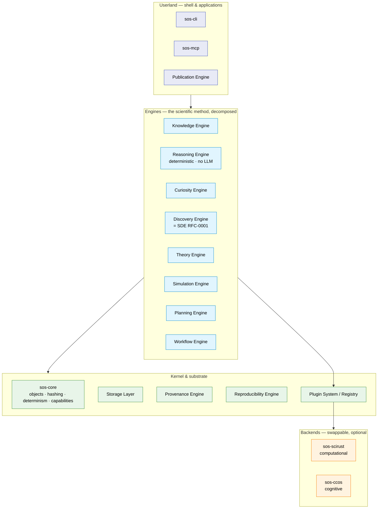

# Scientific Operating System (SOS) — RFC-0002

> The operating system of scientific reasoning. SOS does not execute
> calculations; it executes **the scientific method itself** — modelling,
> storing, reasoning about, validating, evolving, and discovering scientific
> knowledge, on a deterministic, content-addressed, append-only substrate.

**Status:** Architecture RFC / RFC-0002. Design only — no implementation. Per
the mandate, *implementation begins only after this RFC is accepted.*
See [Non-goals](#non-goals) and the [Roadmap](./12-engineering-and-roadmap.md).

**Relationship to prior work:** The [Scientific Discovery Engine
(RFC-0001)](../sde/README.md) is **one subsystem of SOS** — its Discovery
Engine. This RFC subsumes and generalizes it: the substrate the SDE RFC placed
in `sde-core` is *promoted* to the SOS kernel (`sos-core`), shared by every
engine. Where SDE details a mechanism (memoized workflows, expected-information
planning, provenance signing), this RFC references it rather than repeating it.

---

## The thesis, in one paragraph

Scientific software today executes algorithms. SOS executes *reasoning*. It
treats the scientific method as a computation over immutable, content-addressed
objects — questions, laws, hypotheses, experiments, evidence, theories — related
by a directed acyclic graph that is never destroyed and only ever grows. On top
of that substrate sit a dozen cooperating engines: a **Knowledge Engine** (a
real semantic knowledge graph, not documentation), a **Reasoning Engine**
(deterministic, LLM-free: logic, constraint propagation, symbolic and
dimensional analysis, proof propagation, contradiction detection), a **Curiosity
Engine** (which continuously *generates* scientific questions), the **Discovery
Engine** (the SDE loop), a **Theory Engine**, a **Simulation Engine**, and the
provenance, reproducibility, workflow, planning, and publication engines that
make every result traceable, re-runnable, and citable. SciRust is the preferred
**computational** backend and CCOS the preferred **cognitive** backend, but SOS
depends on neither: both attach as swappable plugins. If LLVM is the
infrastructure of compilers and Git of software history, SOS aims to be the
infrastructure of scientific knowledge for the next twenty years.

---

## SOS *is* an operating system — the metaphor is the architecture

This is not branding. Every OS concept maps to a concrete SOS subsystem, and the
mapping is the design's organizing spine.

| Operating-system concept | SOS subsystem | Realized by |
|---|---|---|
| **Kernel** — the trusted core, the syscall ABI | **`sos-core`** | object model, content-addressing, determinism levels, capabilities, the stable engine traits |
| **Filesystem** — "everything is a file" | **Storage Layer** (`sos-store`) | "everything is a *hashed object*"; content-addressed store |
| **Processes + scheduler** | **Workflow Engine** (`sos-workflow`) | workflows as immutable DAGs, memoized, incrementally recomputed |
| **Long-term / virtual memory** | **Cognitive backend** (`sos-ccos`) | CCOS scientific memory, semantic retrieval, persistence |
| **ALU / FPU / coprocessor** | **Computational backend** (`sos-scirust`) | SciRust solvers, stats, GP, signal, GPU, autodiff |
| **Device drivers** | **Plugin System** (`sos-registry`) | static / WASM / MCP adapters |
| **Package manager** (Nix) | **Reproducibility Engine** (`sos-repro`) | hermetic, pinned, re-executable environments |
| **Version control** (Git) | **Provenance Engine** (`sos-provenance`) | append-only history, signing, branch/merge |
| **Compiler & linker infra** (LLVM) | **Reasoning Engine** (`sos-reasoning`) | deterministic derivation, proof propagation, explanation |
| **init / idle daemon** | **Curiosity Engine** (`sos-curiosity`) | the always-on process that generates scientific work |
| **Registry / knowledge base** | **Knowledge Engine** (`sos-knowledge`) | the scientific knowledge graph |
| **Shell + userland** | **CLI / MCP / Publication** | `sos-cli`, `sos-mcp`, `sos-publication` |
| **Applications** | Discovery (`sde-*`), Theory, Simulation, Planning | the scientific "programs" that run on the OS |

The three analogies from the SDE RFC (Git for history, LLVM for a retargetable
IR, Nix for hermetic reproducibility) are not discarded — they become three of
the boxes above. SOS is the OS that hosts all of them.

---

## Subsystem catalog

---

## Document map

| # | Document | Answers (RFC section) |
|---|---|---|
| 00 | **README** (this file) | What is SOS; the OS metaphor; subsystem map. |
| 01 | [Vision & Principles](./01-vision-and-principles.md) | Why; the invariants; pure-Rust/no-FFI mandate; non-goals. |
| 02 | [System Architecture](./02-system-architecture.md) | Overall architecture; kernel/userland; the syscall ABI; the two backends; subsystem dependency graph. |
| 03 | [Object Model](./03-object-model.md) | The immutable scientific object model; the envelope; metadata; serialization, hashing, versioning. |
| 04 | [Knowledge Engine](./04-knowledge-engine.md) | The knowledge model — a real semantic knowledge graph. |
| 05 | [Reasoning Engine](./05-reasoning-engine.md) | The reasoning model — deterministic, LLM-free, explanatory. |
| 06 | [Curiosity Engine](./06-curiosity-engine.md) | How SOS generates its own scientific questions. |
| 07 | [Discovery, Experiment & Theory](./07-discovery-experiment-theory.md) | The SDE loop; Bayesian experiment planning; theories as first-class evolving objects. |
| 08 | [Workflow & Simulation](./08-workflow-and-simulation.md) | The workflow model; backend-independent simulation interfaces. |
| 09 | [Provenance, Reproducibility & Storage](./09-provenance-reproducibility-storage.md) | Storage architecture; serialization; hashing; versioning; hermetic re-execution; signing. |
| 10 | [Plugins, Backends & Interfaces](./10-plugins-backends-interfaces.md) | Plugin interfaces; the SciRust & CCOS adapters; CLI; MCP; Publication. |
| 11 | [Workspace & Crate Graph](./11-workspace-and-crate-graph.md) | Workspace layout; crate graph; dependency graph; how SDE nests. |
| 12 | [Engineering & Roadmap](./12-engineering-and-roadmap.md) | Testing strategy; coding standards; phased roadmap; future research. |

---

## Core principle (the invariants, in brief)

Detailed in [01](./01-vision-and-principles.md); stated here so the constraints
are visible up front:

- Scientific knowledge is **immutable, content-addressed objects**; reasoning is
  a **DAG**; nothing is destroyed; everything is **append-only**.
- Every object carries a **content hash, provenance, reproducibility metadata,
  version, and signature**.
- **Deterministic, reproducible, auditable, testable, documented** — non-optional.
- **Pure Rust. No FFI. No `unsafe`** unless mathematically justified and proven.
  **No TODO, no placeholder, no stub, no mock** presented as production. Every
  merged phase is production-ready.
- **Backend-independent.** SciRust and CCOS are the *preferred* backends, wrapped
  through adapters; the kernel depends on neither.
- **Propose with cognition, verify with deterministic reasoning.** LLM/cognitive
  backends (CCOS) may *propose* questions and hypotheses; they may never be the
  reasoner. Every proposal is attested and must survive deterministic checking.

---

## Non-goals

- **Not another AI/ML framework, not a notebook.** SOS *orchestrates* reasoning
  and computation; it does not add a modelling toolkit. The Reasoning Engine is
  explicitly LLM-free.
- **Not a numerical library.** It wraps SciRust; it never duplicates SciRust or
  CCOS functionality.
- **Not an oracle of truth.** SOS guarantees that reasoning is consistent,
  reproducible, auditable, and explained — not that a domain's model is correct.
- **Not a monolith delivered at once.** Incremental, critique-first delivery;
  each phase ends production-ready with zero technical debt.

---

> Continue to **[01 · Vision & Principles →](./01-vision-and-principles.md)**
